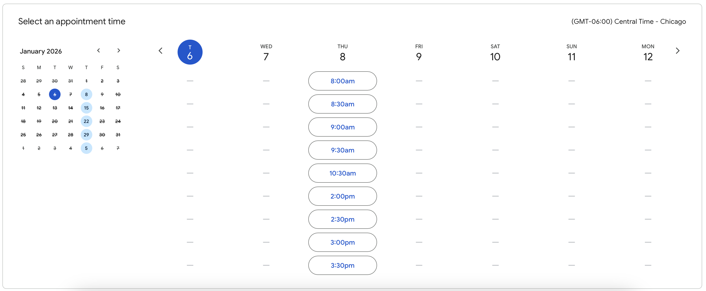

There are many ways to get support, and you’re always welcome to reach out. I’m happy to talk through your ideas and help figure out the best way to move forward together. The Services section on the Goals & Services page provides an overview of how I can help and offers a helpful starting point.

You’ll find details about open office hours below, which are a great way to have a short conversation, ask questions, and explore potential collaborations. For larger or longer-term projects, the project intake form helps me better understand your needs and prioritize support.

# Contact Me

<div class="profile-grid">

:::{card}
```{image} images/portrait.png
:width: 100px
```
:::

:::{card}
My name is **Nikki Tebaldi**, and I am the **Open Source Research Software Engineer** supporting the Schmidt Fellows.
:::

</div>

:::{card}
**Contact Information**

- Email: ntebaldi@uchicago.edu
- Office: Ryerson Laboratory, 257D
- Bio: https://datascience.uchicago.edu/people/nikki-tebaldi/
:::

:::{note}
I am also active on the `Schmidt Futures AI in Science Postdocs at UChicago` Slack workspace. Please reach out anytime!
:::

# Office Hours

[](https://calendar.app.google/XJzUy2dvXn4tKeoB9)

Office hours are flexible to accommodate a wide range of research software engineering questions in support of developing high-quality, open-source, and sustainable research software aligned with Fellowship expectations.

- Held Every **Thursday**
- **Bookable** 30-minute time slots
- [Booking Link](https://calendar.app.google/XJzUy2dvXn4tKeoB9)

# Project Intake

```{image} images/project_intake_form.png
```

In addition to office hours, we use a project intake form to help guide larger or longer-term research software engineering projects and collaborations.

The form collects information about your technical goals, timelines, and software needs so we can better understand the scope of the work and plan appropriate support.

Submitting the intake form helps ensure that requests are aligned with Fellowship expectations and allows us to prioritize effort, coordinate resources, and set realistic next steps for sustained collaboration.
[Project intake form link.](https://docs.google.com/forms/d/e/1FAIpQLSdq0O1qz2xmegB7SBtazen1m-eGKProoUD1Hox2bAW1eTxFUQ/viewform?usp=header)