# GitHub Actions workflows for reproducible science [DRAFT]

## Repository: https://github.com/chicago-aiscience/workshop-github-actions-2026-feb

## Objectives

By the end of this workshop, participants will be able to:

- **Create a reproducible, released version of scientific code**
- Understand GitHub Actions workflows and their components
- Automate linting, formatting, and versioning
- Control workflow execution and pass information between jobs
- (Bonus) Run workflows across environments and share artifacts

**Lesson objectives**

- **Lesson 1:** What GitHub Actions and releases are, and why they matter for reproducible science
- **Lesson 2:** How to modify workflows to automate versioned execution
- **Lesson 3:** How to produce and reference a released version of scientific code

**GitHub Releases as the Reproducibility Anchor**

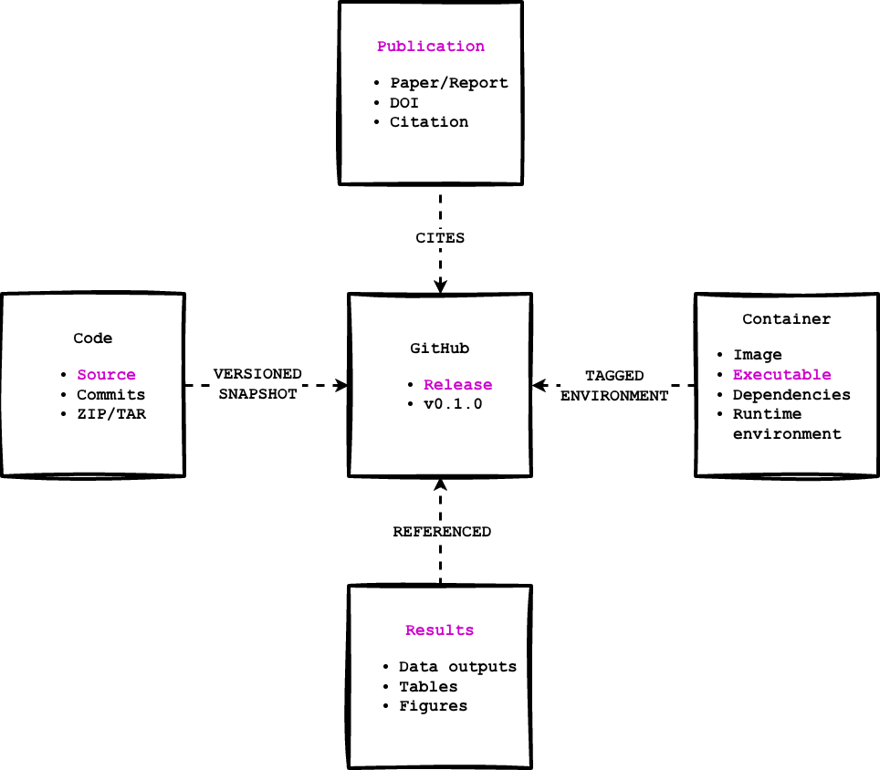

**Workshop goal:** Create a released version of the code.
A GitHub release is a versioned snapshot of your code at a specific point in time:
- Tied to a version number (e.g., v1.2.0)
- Captures the exact files and changes
- Provides downloadable source archives
- Can include notes, citations, and related artifacts

For scientific code, releases:
- Provide a stable reference for results
- Connect figures and tables to code changes
- Support long-term reproducibility
- Can be cited in publications

The release is the anchor connecting: `code → results → containers → publications`

## Symbols

- 👉 - Some action should be taken in the workshop steps (indicates interactive step)
- 🧰 - A tip that might make something easier or provides further explanation
- 🔍 - How to adapt the current workflow step to your own codebase
- ✨ - Time to pause for reflection and absorb content
- ✅ - Verification checkpoint to determine current progress

## Pre-requisites

This workshop assumes some familiarity with GitHub and Python, but no prior experience with GitHub Actions or CI/CD is required.

Before attending, participants should complete the following:

### Required

- **1. A GitHub account**
  - You must be able to clone repositories and push commits to GitHub.
  - Public repositories are recommended so GitHub Actions runs are free.

- **2. A local development environment with Git installed**
  - A laptop with macOS, Linux, or Windows
  - A terminal or command prompt
  - Git installed and working (`git --version` should succeed)
  - See ["Install Git on Windows, macOS, Linux"](#install-git-on-windows-macos-and-linux) for step-by-step instructions
  - **For Windows users:** Windows participants should use Git Bash for all terminal commands

- **3. GitHub Personal Access Token (PAT)**
  - You will need a **GitHub Personal Access Token** to allow workflows to authenticate with GitHub when creating commits, tags, or releases.
  - Create a **fine-grained personal access token** or **classic token** with at least:
    - `repo` and `workflow` (classic) **or**
    - Repository **Contents: Read and write** (fine-grained)
  - Save the token somewhere secure; you may need it when you push code up to your repository
  - [GitHub documentation link](https://docs.github.com/en/authentication/keeping-your-account-and-data-secure/managing-your-personal-access-tokens)
  - See ["Create a GitHub Personal Access Token"](#appendix-create-a-github-personal-access-token) for details

- **4. Basic Git and GitHub knowledge**
  - You should be comfortable with:
    - Cloning a repository
    - Creating and committing files
    - Pushing commits to a branch (e.g. `main`)
  - You do *not* need advanced Git skills (rebasing, submodules, etc.).
  - [Sofware Carpentry, "Version Control with Git" lesson](https://swcarpentry.github.io/git-novice/)
  - ["Learn Git Branching" interactive visual tutorial](https://learngitbranching.js.org/?locale=en_US)

### Recommended (but not strictly required)

- **Familiarity with Python scripts**
  - Understanding what a Python script does and how to run one
  - You do *not* need to be an expert Python developer

- **Basic understanding of configuration files**
  - Some exposure to formats like YAML, TOML, or JSON is helpful
  - YAML will be introduced during the workshop

- **Text editor or IDE**
  - Examples: VS Code, PyCharm, Vim, or similar
  - Syntax highlighting for YAML is helpful but optional

### Not Required

- Prior experience with GitHub Actions or CI/CD
- Experience publishing Python packages
- Docker or container experience
- HPC or cloud computing experience

**Note:** All workflows are executed using GitHub-hosted runners. You will not need to configure any external infrastructure or credentials for the core workshop material.

# Lesson 1: GitHub Actions introduction

This lesson introduces GitHub Actions through a guided walkthrough of a full example, focusing on concepts rather than syntax.

***Objectives:***
- Understand what GitHub Actions is and what types of tasks it can support
- Review a full working example to understand the pieces of a continuous integration and continuous delivery (CI/CD) pipeline as a high level overview - There is no need to dive into the specifics quite yet!
- Understand GitHub Actions quotas and limitations

> GitHub Actions is a continuous integration and continuous delivery (CI/CD) platform that allows you to automate your build, test, and deployment pipeline.
-- ["Understanding GitHub Actions"](https://docs.github.com/en/actions/get-started/understand-github-actions)

But what does that mean for a scientific algorithm or workflow?
- How does this apply to scientific code that is not published as a package?
- How do you tie code changes to results that are then referenced in a publication?
- How do you support reproducible execution?

We will work toward answering these questions throughout the workshop. In short, CI/CD (including GitHub Actions) provides a practical framework for addressing them, but applying these ideas to scientific code requires first building a foundation in how CI/CD works beyond traditional software packaging and deployment.

At its core, a GitHub Actions workflow is a YAML file that defines automated tasks triggered by events such as pushes, pull requests, or manual runs. By borrowing established practices from Python package development and software engineering, these workflows can support reproducible execution, connect code changes to results, and bring CI/CD concepts into existing scientific codebases.

🧰 Throughout this workshop, remember: workflows define _when_ automation runs, jobs define _what_ runs, steps define _how_ it runs, and actions package reusable functionality that steps can run. This will become more clear as we work through examples.

## Reference Example: Full GitHub Actions Setup

[This GitHub repository](https://github.com/chicago-aiscience/workshop-sst) contains _everything_!! It includes implemented best practices and forms the foundation for the RSE workshop series (this workshop's repository was created from it). This repository contains a complete example that forms the foundation of the RSE workshop series. It includes:

- A toy scientific workflow (climate pattern prediction from sea surface temperature data)
- A fully defined GitHub Actions workflow following best practices (uses GitHub secrets; more advanced)
- GitHub templates for issues, pull requests, and discussions
- Core open source project files (README, license, code of conduct, citation)
- Python package-style layout (src/ and tests/)
- A GitHub Pages documentation site (docs/)
-  A Dockerfile for building a containerized executable
- Repository settings that support long-term maintenance (branch protection, etc.)

**Workshop focus:** For this workshop, primary attention will be on the GitHub Actions workflow [definition file](https://github.com/chicago-aiscience/workshop-sst/blob/main/.github/workflows/deploy.yml).

## Workshop Example: Simplified Workflow

The full workflow example is fairly complex. For this workshop, we will use a simpler version that still includes key pieces from the complete example, but lets you start small and add one piece at a time.

Throughout the workshop, we will highlight checkpoints in the code and use 🔍 callouts to show how GitHub Actions can be adapted for existing codebases.

We will focus on the major components first, then introduce additional pieces from the full example for context and completeness.

**Workshop focus vs. reference content**

The simplified workflow derived from the full example will focus on a core subset of jobs that support reproducible science:

- Workflow setup and triggers
- Linting + basic quality checks
- Versioning and releases

Other jobs (testing matrices, security scanning, container builds, documentation) are included as reference to show how a complete, production-ready workflow can grow over time but they are not required to follow the workshop.

## Workshop components (we will focus on these)

Let's walk through some of the workshop sections to better understand what you can do with GitHub actions and how it supports our goal of tying versions of code to results.

Don't worry about the technical details and definitions at this point as we will dive into those later in the workshop.

### Workflow set up (workshop core)

Set the name of your workflow:
```yaml
name: Deploy Workshop Workflow
```

> 🧰 Note: You are not expected to write or fully understand these YAML files yet. The goal of this lesson is to recognize the structure of a workflow and how it connects code changes to results.

Define when the workflow is triggered:
```yaml
on:
  push:
    branches: [ dev, main ]
```
- You can automatically trigger workflow execution using different event types. In this case you can trigger it to run whenever a commit is pushed to the `dev` or `main` branches
	- [Documentation for the `on` keyword](https://docs.github.com/en/actions/reference/workflows-and-actions/workflow-syntax#on)
	- [Documentation on event types](https://docs.github.com/en/actions/reference/workflows-and-actions/events-that-trigger-workflows)

Only let one instance of the workflow execute at a time:
```yaml
concurrency:
```
- [Documentation on concurrency ](https://docs.github.com/en/actions/reference/workflows-and-actions/workflow-syntax#concurrency)

Define environment variables for the entire workflow:
```yaml
env:
```
- [Documentation on environment variables](https://docs.github.com/en/actions/reference/workflows-and-actions/workflow-syntax#env)

### Jobs (workshop core)

Jobs execute steps in a workflow. You define `jobs` in the workflow file to indicate you are going to list all of the jobs:

```yaml
jobs:
```

### Lint and Format Job (workshop core)

The lint and format job uses `ruff` to lint and format the codebase. Both linting and formatting are about code quality and help maintain a codebase over time keeping the code "clean" and formatted through versions.

A linter will analyze code and flag bugs, error-prone patterns, unused variables and imports, and violations of code rules.

A formatter rewrites your code's layout so it follows a standard style around indentation, spacing, line breaks, quote style, and brace placement.

```yaml
  lint-and-format:
    runs-on: ubuntu-latest
    steps:
```

This repo uses `ruff` for both linting and formatting. [The Ruff Formatter Documentation](https://docs.astral.sh/ruff/formatter/)

### Version Job (workshop core)

This job is a little bit complicated as version control can be hard! This step takes the version as defined in the `pyproject.toml` file and updates it based on the current branch (as determined by the push trigger). So this job locates the next version of the application. **This is super helpful in tying results to code** as a version provides a numeric tag which can be used to identify code modifications and supports the creation of a release (the last step in the workflow).

```yaml
version:
    runs-on: ubuntu-latest
    outputs:
      app_version: ${{ steps.dev.outputs.app_version != '' && steps.dev.outputs.app_version || steps.release.outputs.app_version }}
      deploy_env: ${{ steps.dev.outputs.deploy_env != '' && steps.dev.outputs.deploy_env || steps.release.outputs.deploy_env }}
      dev_ran: ${{ steps.dev.outcome == 'success' && 'true' || 'false' }}
      release_ran: ${{ steps.release.outcome == 'success' && 'true' || 'false' }}
      bump_type: ${{ steps.dev.outputs.bump_type != '' && steps.dev.outputs.bump_type || steps.release.outputs.bump_type }}
    steps:
```

### Release job (workshop core)

The release job creates a release in the GitHub repository. A release generates compressed archives of your codebase that capture all modifications at the time the release is created. You can also include release notes, a list of contributors, and links to binary files. [See the documentation for more information](https://docs.github.com/en/repositories/releasing-projects-on-github/managing-releases-in-a-repository).

This is really helpful for tying specific code modifications to results. By associating a particular version of your code with a release, you can support reproducible executions of your algorithms and reference that exact version in a publication.

In our example, the release does not include a full executable since we rely on the container image for that, but it does allow us to retain compressed source archives that can be used to connect results to a specific version.

```yaml
release:
    runs-on: ubuntu-latest
    needs: [version, build-deploy]
    permissions:
      contents: write    # required to push commits/tags
    if: needs.version.outputs.dev_ran == 'true' || needs.version.outputs.release_ran == 'true'
    steps:
```

### Test Job (BONUS)

The test job executes existing unit tests located in the `test` directory on multiple Python versions using a `matrix` (more to follow in the workshop). This ensures any changes you made do not break previous functionality and execution of the code is performing as you would expect.

```yaml
  test:
    runs-on: ubuntu-latest
    strategy:
      matrix:
        python-version: ["3.10","3.11","3.12"]
    steps:
```

## Reference example components

The full reference example includes all of the above workshop components plus a few extra components detailed below.

### Scan Job (reference only)

The scan job scans the codebase for any security vulnerabilities and reports on them in the `Security` tab in the GitHub repository. This ensures anything deployed to an HPC cluster, the cloud, or collaborators' laptops does not include vulnerabilities that could impact computing and risk data breaches.

```yaml
  scan:
    runs-on: ubuntu-latest
    permissions:
      contents: read
      security-events: write
    steps:
```

This repo uses GitHub's code scanning. [GitHub code scanning documentation](https://docs.github.com/en/code-security/code-scanning/introduction-to-code-scanning/about-code-scanning)

### Build and deploy job (reference only)

This job builds a Docker container, tags it with a specific version, and deploys it to the [GitHub Container Registry](https://docs.github.com/en/packages/working-with-a-github-packages-registry/working-with-the-container-registry). The resulting containerized executable captures a fixed snapshot of the code _and_ its dependencies, ensuring it can be run consistently across different environments.

By versioning and hosting the container alongside the codebase, you create a stable, citable artifact that can be referenced to **reproduce the exact computational results used in a publication**.

This makes it possible to rerun analyses, regenerate figures, and validate results long after the original development environment has changed supporting transparency, reproducibility, and long-term research integrity. (Plus it is automated so you don't have to manually build a container with each release.)

```yaml
build-deploy:
    runs-on: ubuntu-latest
    needs: [lint-and-format, scan, test, version]
    if: needs.version.result == 'success' && (needs.version.outputs.dev_ran == 'true' || needs.version.outputs.release_ran == 'true')
    permissions:
      contents: read
      packages: write
    steps:
```

### Documentation job (reference only)

You can create Markdown files to document how to install, set up, and use your codebase. These files can include Jupyter notebooks and detailed descriptions of specific functions or methods that align with content in a publication. You can also automatically generate documentation that includes function signatures, arguments, and return values. All of this documentation can be hosted on a [GitHub Pages website](https://docs.github.com/en/pages).

This is bonus content and is considered slightly more advanced! It will not be covered in this workshop but is shared here as it is a part of the complete example.

```yaml
name: Build and Deploy Documentation

on:
  push:
    branches:
      - main
    paths-ignore:
      - pyproject.toml
      - uv.lock
  workflow_dispatch:

permissions:
  contents: write

jobs:
  build-and-deploy:
    runs-on: ubuntu-latest
    steps:
```

## GitHub Actions quotas and limitations

GitHub Actions usage is free for **public repositories**. Any usage beyond this is billed to your account. See [billing documentation](https://docs.github.com/en/billing/concepts/product-billing/github-actions) for more information.

The limitations are detailed [here](https://docs.github.com/en/actions/reference/limits) and include:
- 2,000 minutes for workflow execution
- 500MB of artifact storage
- 10GB of cache storage
- A workflow execution limit of 35 days
- Each job in a workflow can run up to 6 hours
- A default concurrency limit of 20 jobs

If your account does not have a valid payment method on file, usage is blocked once you use up your quota.

You can check your quota usage for a repository under the `Insights` tab by navigating to "Actions usage metrics."

**These limits matter most when workflows run frequently, build containers, or process large datasets; common patterns in research workflows.**

## Summary

In this lesson, you were introduced to GitHub Actions and how workflows automate common tasks in a repository. Rather than focusing on syntax, the emphasis was on building a mental model for how automation runs in GitHub and how the pieces fit together.

You also explored why GitHub Actions are useful for scientific and research code, where reproducibility depends on rerunning the same steps consistently over time. You should now be able to recognize the core components of a GitHub Actions workflow and understand their roles.

In Lesson 2, we will move from recognizing workflows to modifying and creating them, and you will see how changes to a workflow affect automation, versioning, and reproducibility.

**✨Pause for Reflection #1 (3-4 min)✨**

Grab a piece of paper or sticky note and write short bullets, no full sentences needed.

 1. **Where do your “results” live right now?**
     - e.g., figures/plots, tables, intermediate files, model weights, notebooks, manuscripts
     - What’s the “source of truth” when someone asks: “Which run produced Figure 2?”
 2. **Imagine it’s 6 months from now and you need to reproduce a key figure.** What are the top 2 things most likely to break?
    - (dependencies? data path? randomness? missing scripts?)
 3. **Pick 1 workflow job you’d want “future you” to have. Why?**
     - Lint/format, tests, versioning, release, container build, docs
 4. **Optional pair-share (1 min):** Tell your neighbor what your “biggest reproducibility failure mode” is—and which job would reduce it.

# Lesson 2: Getting started and defining a workflow

This lesson will cover how to get started with GitHub Actions starting with some background information on YAML and the structure of GitHub Action workflow files. The lesson will then cover how to create your first GitHub Action workflow definition file and introduce key components as we add various operations to the file.

This lesson also marks the start of the hands-on portion of the workshop and focuses on this GitHub repository. The repository was created by distilling the larger example introduced in Lesson One into a simpler, more focused workflow. Its goal is to help build a solid foundation in GitHub Actions before layering on more complexity.

***Objectives:***

- Create a `pyproject.toml` file to support project versioning
- Define an initial GitHub Actions workflow file with a name, when it should be triggered, and permissions
- Define a "Lint + Format" job that lints and formats the codebase
- Define a "Version" job that provides versioning for the project

## YAML and defining a GitHub Action workflow

GitHub Action workflows are defined in YAML:

- YAML is a human-readable data serialization standard.
- It includes a syntax that relies on indentation and key-value pairs.
- It represents data structures like lists (sequences) and dictionaries (mappings).

🧰 A YAML file indents can be defined with tabs or spaces but by convention it is best to define indents with two spaces.

Example list

```yaml
fruits:
  - oranges
  - apples
  - bananas
```

Example dictionary

```yaml
fruit:
	name: orange
	price: 2.0
	amount: 500
```

See [the "Continuous Integration / Continuous Deployment tutorial" YAML page](https://hsf-training.github.io/hsf-training-cicd-github/04-understanding-yaml/index.html) for helpful tips on working with YAML.

A GitHub Actions workflow is a YAML file that tells GitHub what to do automatically when something happens in your repository.

## Common GitHub workflow terminology and definitions:

| Term                  | What it means (plain language)                                        | Example                               |
| --------------------- | --------------------------------------------------------------------- | ------------------------------------- |
| Workflow              | A YAML file that defines automated tasks to run in a repository.      | `.github/workflows/deploy.yml`        |
| Action                | A reusable unit of code that performs a single task.                  | `actions/checkout@v4`                 |
| Job                   | A group of steps that run together on the same runner.                | `jobs: test:`                         |
| Step                  | An individual command or action executed as part of a job.            | `- run: pytest`                       |
| Runner                | A virtual machine that runs a job.                                    | `runs-on: ubuntu-latest`              |
| Trigger               | An event that starts a workflow.                                      | `on: push`                            |
| `needs`               | Specifies which job(s) must finish successfully before this job runs. | `needs: build`                        |
| `if`                  | A conditional expression that determines whether a job or step runs.  | `if: github.ref == 'refs/heads/main'` |
| `name`                | A human-readable label shown in the Actions UI.                       | `name: Run tests`                     |
| `id`                  | A unique identifier used to reference a step or job.                  | `id: build`                           |
| `run`                 | Executes a shell command directly on the runner.                      | `run: pytest -q`                      |
| `uses`                | Runs a prebuilt action or reusable workflow.                          | `uses: actions/checkout@v4`           |
| `with`                | Provides input parameters to an action or reusable workflow.          | `with: python-version: "3.11"`        |
| Environment variables | Key–value pairs available to jobs and steps.                          | `env: MY_VAR=value`                   |

🧰 **Workflows contain jobs → jobs contain steps → steps run actions or commands.** Reusable workflows are workflows that call other workflows to avoid repetition.

Remember, workflows define _when_ automation runs, jobs define _what_ runs, steps define _how_ it runs, and actions package reusable functionality that steps can run.

**General structure**

```yaml
name: <name of your workflow>

on: <event or list of events>

jobs:
  job_1:
    name: <name of the first job>
    runs-on: <type of machine to run the job on>
    steps:
      - name: <step 1>
        run: |
          <commands>
      - name: <step 2>
        run: |
          <commands>
  job_2:
    name: <name of the second job>
    runs-on: <type of machine to run the job on>
    steps:
      - name: <step 1>
        run: |
          <commands>
      - name: <step 2>
        run: |
          <commands>
```
*Taken from the CI/CD workshop delivered by the HSF and located at: https://hsf-training.github.io/hsf-training-cicd-github/05-understanding-yaml-and-ci/index.html*

## Define a 'hello world' example

Before we dive too deeply into the workshop workflow, let's first explore a basic GitHub Actions workflow definition but first we have to set up a `git` repository.

### 👉 **Step 1.** Create a new repository

Create a new repository from the template workshop repo. The following steps were taken from ["Creating a repository from a template"](https://docs.github.com/en/repositories/creating-and-managing-repositories/creating-a-repository-from-a-template#creating-a-repository-from-a-template) GitHub documentation.

*Note - This repository is the simplified version of the larger reference example mentioned in Lesson One.*

1. Navigate to the main page of the repository: https://github.com/chicago-aiscience/workshop-github-actions-2026-feb
2. Above the file list and to the right next to the repository name, click "Use this template"

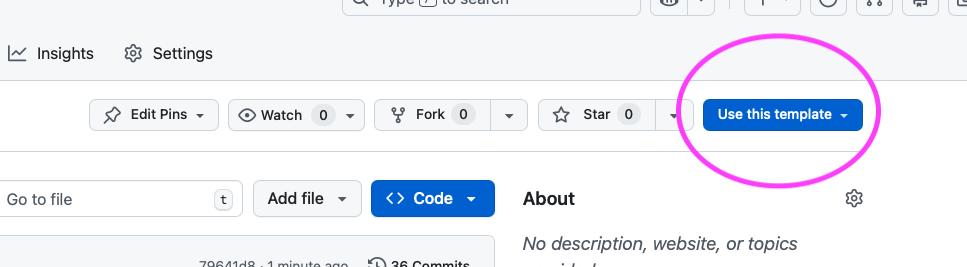

3. Select "Create a new repository"

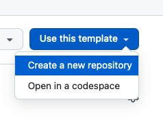

4. Leave the "Start with a template" and "Include all branches" fields set to their defaults
4. Check that your GitHub username is listed in the "Owner" dropdown menu
5. Type a name for your repository: `workshop-github-actions-2026-feb`
6. Include a description if you would like
7. Leave the "Choose visibility" field set to "Public"
8. Click "Create repository"


9. Copy the link to clone your new repository by copying the "HTTPS" link from the "<> Code" dropdown

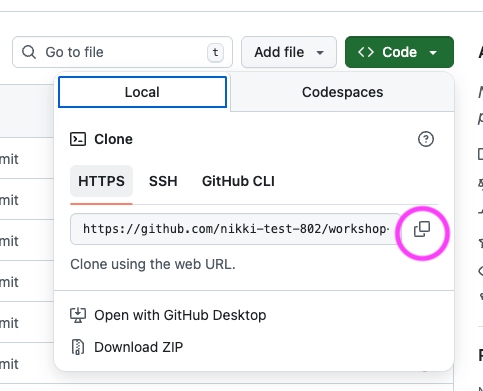

10. Pick a location on your computer (replacing `<code-location>` with a path on your computer) and clone the repository you just created (replacing `<paste-link-here>` with the copied link)
    ```bash
    cd <code-location>
    git clone <paste-link-here>
    ```
11. Navigate to the workshop directory by running the following command:
    ```bash
    cd workshop-github-actions-2026-feb
    ```

**✅ Verification Checkpoint**

- You have a GitHub repository named `workshop-github-actions-2026-feb` under your GitHub account
- You have successfully cloned the repository to your computer
- Running the following command from the repository root works without errors:

```bash
git status
```

### 👉 **Step 2.** Create a definition file

Now we can create the file that defines the GitHub Actions workflow, we will call the file `hello.yml`.

**Create a file (terminal)**

If you are using a Mac or Linux operating sytem you can run the `touch` command on the terminal. Make sure to run this command from the root of the GitHub repository to create the file:

```bash
touch .github/workflows/hello.yml
```

🧰 Note on file creation: Any step that asks you to create a file can be done directly in your IDE instead of using the terminal. Creating files via the editor works the same on Windows, macOS, and Linux and is recommended for this workshop.

**Create a file (IDE)**

If your are using a Windows operating system or do not want to run a command in terminal you can use an IDE to create the file:

1. Open the repository folder in your IDE (VS Code, PyCharm, etc.)
2. In the file explorer: Create a new file (right-click → New File)
3. Name the file exactly as specified, (e.g. `hello.yml`)
4. Save the file

### 👉 **Step 3.** Define the name and trigger for the workflow

Open up the `hello.yml` file in your IDE and type in the following:

```yaml
name: Hello World Example

on:
  workflow_dispatch:    # Allow for manual trigger
```

- `name`: Defines the name of the entire workflow
- `on`: Defines what will trigger the workflow, for now we will only allow for manual execution

### 👉 **Step 4.** Define the jobs and how the workflow will execute

With the `hello.yml` still open in your IDE, type the following at the end of the file:

```yaml
jobs:
  hello_world_job:
    runs-on: ubuntu-latest
    steps:
    - name: Hello World Step
      run: echo 'Hello World'
```

- `jobs` defines all of the jobs that will be run and they run in parallel by default. We will explore sequential execution in a little bit.
- `runs-on` indicates the underlying virtual machine the workflow will run on
- `steps` details the steps which defines the individual commands or actions that will be taken in the workflow
- `name` provides a human readable name for the job
- `run` executes the command on the virtual machine defined by `runs-on`

### 👉 **Step 5.** Commit and push the file up to GitHub

The final workflow file should like this:

```yaml
name: Hello World Example

on:
  workflow_dispatch:    # Allow for manual trigger

jobs:
  hello_world_job:
    runs-on: ubuntu-latest
    steps:
    - name: Hello World Step
      run: echo 'Hello World'
```

1. Add and commit the `hello.yml` file to the `git` repository on the `main` branch:

```bash
git add .github/workflows/hello.yml
git commit -m "GitHub Actions workflow hello world example"
```

2. Push the commit up to the GitHub repository

```bash
git push origin main
```

*Note: There can be issues pushing to GitHub if you haven't set and used your Personal Access Token (PAT) previously. We will hold to work out any issues.*

**✅ Verification Checkpoint**

- A file exists at `.github/workflows/hello.yml`
- The file has been committed and pushed to GitHub

### 👉 **Step 6.** Run the GitHub action

Now that you have a GitHub Actions workflow defined and it is pushed up to GitHub, we can manually trigger the workflow by navigating to the repository on GitHub.

1. Navigate to the repository under your GitHub account: `https://github.com/<your-github-username>?tab=repositories`

    a. Replace `<your-github-username>` with your GitHub username
    b. Click on the repository

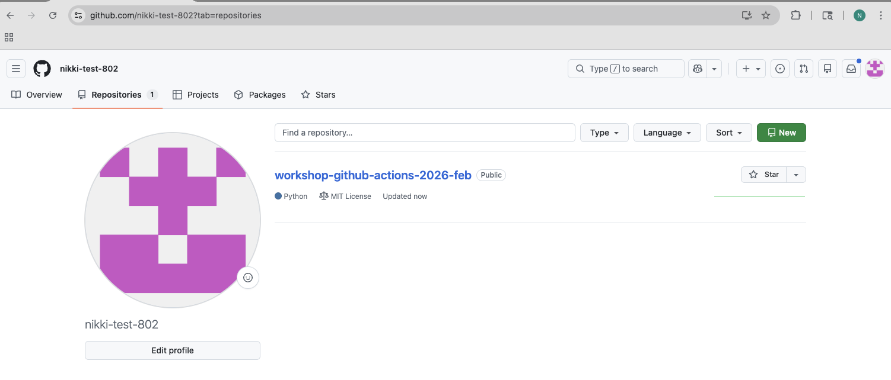

2. Click on "Actions" on the repository home page

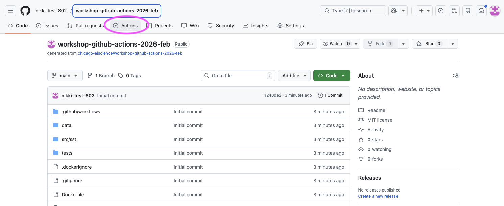

3. The page should display a message: "There are no workflow runs yet." Click on the "Hello World Example" in the left column


4. Let's manually trigger the workflow by clicking on "Run workflow" > Leave the branch set to `main` and click on "Run workflow"


5. You should see the "Hello World Example" running in the main section of the Actions page. You can click on the running example to see more details.

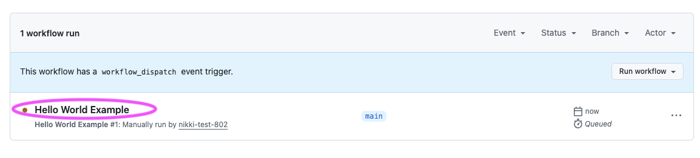

6. You should see a "Summary" of all the details of the executing workflow. You can click on the `hello_world_job` to see logs for each job step's execution.

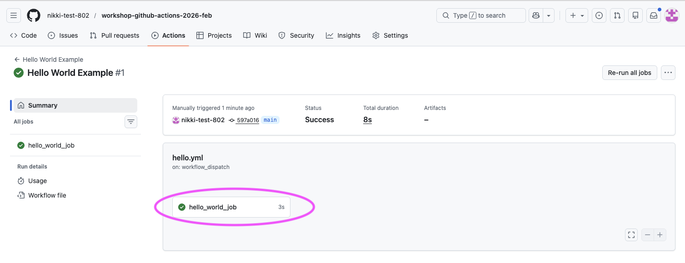

7. View the logs for the "Hellow World Step" to see the "Hello World" texted printed to the log.


You’ve now successfully run your first GitHub Actions workflow. Next, we’ll dig into the core workshop components and start using workflows to do something more meaningful for reproducible scientific code.

**✅ Verification Checkpoint**

- The Hello World Example workflow run completed successfully
- The job hello_world_job shows a green checkmark
- The workflow logs include the line:
    ```bash
      Hello World
    ```
- If you see this output in the logs, the workflow ran successfully.

## The workshop project and version

For this workshop we will consider a GitHub Action workflow with three steps plus one bonus step:

1. Lint and format
2. (Optional Bonus) Test
3. Version
4. Release

In order for the version step to execute correctly, we need a way to indicate a version number. A minimal `pyproject.toml` file will assist in this.

**Brief note on project structure**

The GitHub Actions workflow definition is broken into reusable workflows where there is one workflow per job. We will refer to these reusable workflows as jobs in the context of this workshop as they are intended for you to be able to plug into your own codebases and use. We will indicate when you can re-use a workflow job and what inputs and permissions are required with a 🔍 symbol.

🧰 It should be noted that typically, the jobs are all defined in a single file and there is no need to break these up by job unless you want to reuse specific definition files across repositories and projects. Example file without reusable workflow "jobs": https://github.com/chicago-aiscience/workshop-sst/blob/main/.github/workflows/deploy.yml

🧰 Note on terminology: In GitHub Actions, a _reusable workflow_ is technically a workflow that calls another workflow. In this workshop, we refer to these reusable workflows as “jobs” because they behave like plug-in jobs you can reuse across repositories.

### 👉 **Step 7.** Define a `pyproject.toml`

The `pyproject.toml` file is a single place to define a Python project and how it should be installed and run. It defines details like:

- The name of your project
- The version of your project
- What version of Python is required
- What dependencies your project uses
- (Optionally) How to run as a command-line tool

*Let's add a `pyproject.toml` file to the repository.*

Here is a minimal definition:

```toml
[project]
name = "sst"
version = "0.1.0"
description = "A sea surface temperature ML prediction package for workshops (SST + ENSO)."
readme = "README.md"
requires-python = ">=3.10"
license = { text = "MIT" }
authors = [{ name = "Nikki Tebaldi" }]

dependencies = [
  "numpy>=1.26",
  "pandas>=2.1",
  "scikit-learn>=1.3",
  "matplotlib>=3.8",
  "seaborn>=0.13.2",
  "typer>=0.9",
  "ruff>=0.14.10",
  "pytest>=9.0.2",
]

[project.scripts]
sst = "sst.cli:app"
```

****Note the `version` key as that is important for the version GitHub Actions job.***

🔍 Checkpoint #1: You can use the following examples as a template to create your own `pyproject.toml` for your codebase and fill in the necessary details for the project `[project]`, dependencies, and script entry point `[project.scripts]`.

- Then you can implement versioning for your own projects. The minimum requirement for this workshop is to have a `version` key specified and an entrypoint `[project.scripts]` defined for testing.

### 👉 **Step 8.** Create the `pyproject.toml` file and add it to the Git repository:**

1. Create the file:
    ```bash
    touch pyproject.toml
    ```
    *a. If you cannot run the `touch` command (Windows users) then you may follow ["Step 2."](#-step-2-create-a-definition-file) to create a file via the IDE (make sure to call if `pyproject.toml`)*
2. Open the file and copy and paste the above definition
3. Add your name to the `authors` list:
    ```toml
    authors = [{ name = "Nikki Tebaldi }, { name = "Your Name" }]
    ```
3. Save the file
4. Commit the file to the repository on the `main` branch
    ```bash
    git add pyproject.toml
    git commit -m "Define a pyproject file that points to a specific version"
    ```

**✅ Verification Checkpoint**

- A file named `pyproject.toml` exists in the root of your repository
- The file has been committed to the `main` branch
- The file includes:
    - a version field under `[project]`
    - a command-line entry point under `[project.scripts]`
- Running the following command shows a clean working tree: `git status`

## Define the `deploy.yml` GitHub Actions workflow file

Now let's create the GitHub Actions definition file which will execute all of the jobs in our workflow.

### 👉  **Step 9.** Create the definition file

Create the file by running the following command from the root of the GitHub repository

```bash
touch .github/workflows/deploy.yml
```

*If you cannot run the `touch` command (Windows users) then you may follow ["Step 2."](#-step-2-create-a-definition-file) to create a file via the IDE (make sure to call if `deploy.yml`)*

- Notice the other `*.yml` files in the `.github/workflows` directory: There is one per job (e.g., lint-and-format, scan, test, version, release, etc.) defined in the `.github/workflows` directory
- These are reusable workflows and allow us to simplify the workshop but still provide a full example that you can incorporate into your own codebases and are denoted as "(Internal)" so you know they are to be used in a top-level workflow
- See the `.github/workflows/deploy-full-example.yml` file for the entire CI/CD pipeline but note this includes a scan job and a container job not covered but may be useful to have

### 👉  **Step 10.** Define a name for the workflow and when it should be triggered

Type the following into the top of the `deploy.yml` file

```yaml
name: Deploy Workshop Workflow

on:
  workflow_dispatch:    # Allow for manual trigger
```

🧰 For ease in the workshop we will trigger the workflow manually. But you may want to automate the entire workflow and have it run when you push a commit to the `main` branch. The `deploy-full-example.yml` includes this:

```yaml
on:
  push:
    branches: [main]
    paths-ignore:
      - pyproject.toml
      - uv.lock
```

Notice that the `pyproject.toml` and `uv.lock` files are ignored. If you only make changes to either of these files, commit, and push them to the GitHub repository they will **not** trigger the workflow.

### 👉 **Step 11.** Define workflow permissions

Add this to the end of the `deploy.yml` file under the `workflow_dispatch` content

```yaml
permissions:
  contents: read
```

Permissions control what the GitHub Actions runner is allowed to do on your behalf, such as creating releases or pushing tags. Using the minimum required permissions is a best practice for security and reproducibility.

Some common permissions include:

| Permission               | What it allows                                                 | Typical use in workflows                                             |
| ------------------------ | -------------------------------------------------------------- | -------------------------------------------------------------------- |
| `actions: read`          | Read information about workflow runs and jobs.                 | Used by tools like CodeQL to report status and gather run metadata.  |
| `contents: read`         | Read repository contents (files, commits, tags).               | Required for checking out code, reading files, and running CI jobs.  |
| `contents: write`        | Read and modify repository contents (commits, tags, releases). | Required for version bumping, tagging, and creating GitHub releases. |
| `packages: write`        | Publish packages to GitHub Package Registry (e.g. GHCR).       | Used to build and push Docker images to `ghcr.io`.                   |
| `security-events: write` | Upload security scan results to GitHub.                        | Required for CodeQL code scanning and SARIF uploads.                 |

### 👉  **Step 12.** Define the "Lint + Format" job

The "Lint + Format" job maintains code quality over time keeping the code "clean" and formatted through versions.

Add this to the end of the `deploy.yml` file after the permissions:

```yaml
jobs:
  lint-and-format:
    name: Lint + format
    uses: ./.github/workflows/lint-and-format.yml
```

- `jobs` defines all of the jobs that will be run and they run in parallel by default. We will explore sequential execution in a little bit.
- `name` provides a human readable name for the job
- `uses` indicates the reusable workflow definition that will be loaded

Let's dive deeper into the full "Lint + Format" reusable workflow definition so we can explore the contents.

```yaml
name: (Internal) Lint and format

on:
    workflow_call:

permissions:
    contents: read

jobs:
  lint-and-format:
    runs-on: ubuntu-latest
    steps:
      - name: Check out repository
        uses: actions/checkout@v4

      - name: Setup uv
        uses: astral-sh/setup-uv@v4
        with:
          version: "latest"

      - name: Install
        run: uv sync

      - name: Run ruff check
        run: uv run ruff check .

```

- `workflow_call` indicates this is a reusable workflow file and will be triggered when called by another workflow
- `permissions` provides the permissions required by the jobs to run successfully, in this case the contents of the repo can be read
- `jobs` defined the workflow jobs to execute
	- `lint-and-format` defines a single job
	- `runs-on` defines what machine type the job should be run on; many runner types are available and are listed on the ["Standard GitHub-hosted runners for public repositories"](https://docs.github.com/en/actions/reference/runners/github-hosted-runners#standard-github-hosted-runners-for-public-repositories) section of the docs
	- `steps` are the individual steps that will be executed in the job
		- `name` is the name of the individual step
		- `uses` indicates a specific GitHub Actions to use in a step
		- `with` indicates any parameters that should be passed into the action
		- `run` indicates a specific command to run (helpful if there is no GitHub Actions defined for the task)

This job does the following:

1) It checks out the repository code and makes it available to the GitHub Actions on the runner
2) It sets up `uv` and makes it available to the runner's environment
3) It installs the package dependencies defined in the `pyproject.toml` file
4) It runs `ruff` to lint and format the code

### 👉 **Step 13.** Define a "Version" job

This job solves a common reproducibility problem: how to consistently identify which version of the code produced a specific result.

Add this to the `deploy.yml` file after the "Lint + Format" job:

```yaml
  version:
    name: Compute version
    uses: ./.github/workflows/version.yml
```

- The "Version" job is set up very similarly to the "Lint and Format" job. Note the use of `name` for the name of the job and `uses` to point to the reusable workflow file

Looking at the job definition file:  `version.yml`

```yaml
name: (Internal) Compute version

on:
  workflow_call:
    outputs:
      app_version:
        description: Computed app version
        value: ${{ jobs.version.outputs.app_version }}

jobs:
  version:
    runs-on: ubuntu-latest
    outputs:
      app_version: ${{ steps.release.outputs.app_version != '' && steps.release.outputs.app_version || steps.get_version.outputs.app_version }}
    steps:
      - name: Check out repository
        uses: actions/checkout@v4

      - name: Setup uv
        uses: astral-sh/setup-uv@v4

      - name: Get current version
        id: get_version
        run: |
          echo "app_version=$(uv version | awk '{print $2}')" >> $GITHUB_OUTPUT

      - name: Next app version (release)
        if: startsWith(github.ref, 'refs/heads/main') || github.base_ref == 'main'
        id: release
        run: |
          uv version --bump patch
          echo "app_version=$(uv version | awk '{print $2}')" >> $GITHUB_OUTPUT
          git checkout pyproject.toml    # reset to original version
          git checkout uv.lock    # reset to original version

```

There are a few key things to notice that differ slightly from the "Lint and Format" job:

1) This job determines the current version of the project and computes what the next version should be
	- It gets the current version using `uv version` and if the branch that triggered the workflow is `main` it then updates the patch version of the project (`0.6.2` --> `0.6.3`): `uv version --bump patch`
2) The structure and use of `workflow_call`, `jobs`, `name`, `uses`, `run` are the same as the "Lint and Format" job
3) The "Version" job uses `id` which is a unique way to identify a step in a job and reference later in the same job. This is useful if the step produces output that can be used by other steps
	- The `id` field uniquely identifies the output from the "Get current version" step and the "Next app version (release)" step
		- *A new version is only created when there is a modification made to the `main` branch creating a simple versioning scheme to track modifications*
	- The output for each step is saved to `$GITHUB_OUTPUT` which is a special path provided by GitHub Actions that a step can write output to in the form of key, value pairs
4) `outputs` defines outputs for the entire job and can be referenced by other jobs
	- In the "Version" job the `app_version` is saved so other jobs can reference the correct version
	- The value of the expression that sets the `app_version` looks at the `release` step first to determine if a new version was detected and if not falls back to the `get_version` step

### 👉 **Step 15.** Add, commit, and push the `deploy.yml` to GitHub

1. Add and commit the `deploy.yml` file to the `git` repository on the `main` branch:

```bash
git add .github/workflows/deploy.yml
git commit -m "GitHub Actions workflow definition with linting, formatting, and version"
```

2. Push the commit up to the GitHub repository

```bash
git push origin main
```

**✅ Verification Checkpoint**

Final file:

```yaml
name: Deploy Workshop Workflow

on:
  workflow_dispatch:    # Allow manual triggering of the workflow

permissions:
  contents: read

jobs:
  # 🔍 Checkpoint #2: Use these jobs in your own project
  lint-and-format:
    name: Lint + format
    uses: ./.github/workflows/lint-and-format.yml

  version:
    name: Compute version
    uses: ./.github/workflows/version.yml
```

🔍 Checkpoint #2: You can create a `deploy.yml` file for your own project and reuse the Lint + Format and Version jobs. Follow the same steps from this workshop and adapt the workflow to your codebase, including updating triggers as needed.

You should now have a top-level workflow that GitHub recognizes and that correctly calls the reusable workflows.

1. File exists in the correct location
   - A file exists at:
     ```
     .github/workflows/deploy.yml
     ```
2. Workflow has the required top-level keys
   - The `deploy.yml` file includes:
     - `name: Deploy Workshop Workflow`
     - `on: workflow_dispatch`
     - `permissions: contents: read`
     - `jobs:` with both `lint-and-format` and `version` defined
3. Reusable workflow paths are correct
   - The jobs reference reusable workflows using:
     - `uses: ./.github/workflows/lint-and-format.yml`
     - `uses: ./.github/workflows/version.yml`
4. Changes are committed and pushed
   - Running the following command reports a clean working tree:
     ```bash
     git status
     ```

### 👉 **Step 16.** Run the GitHub Actions workflow

Now that you have a complete `deploy.yml` file with the "Lint + Format" and "Version" jobs. Let's explore how to manually trigger the workflow in GitHub.

Please see ["Workflow set up"](#workflow-set-up) for information on how to trigger a job automatically based on different events. For this workshop, we will manually trigger the workflow to keep things simple.

1. Navigate to the repository on GitHub and click on "Actions"


2. You will see all of the workflows listed in the left column (1) and a list of workflow runs you may have previously executed. Click on "Deploy Workshop Workflow" (2) in the left column (this is the name we defined in the `deploy.yml` file)


3. Click on "Run workflow" (1), leave the branch to run the workflow on set to `main` (2), and click "Run workflow" (3)

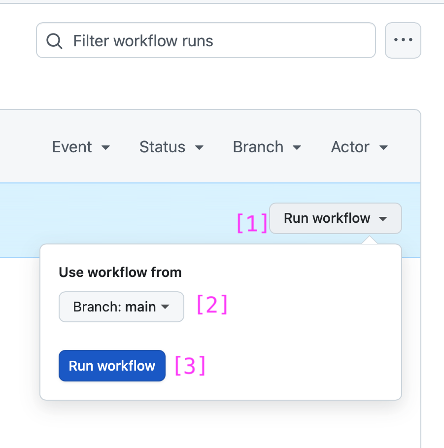

4. You should see the manual execution of the workflow running: `Deploy Workshop Workflow`. Click on "Deploy Workshop Workflow" (1)


5. You can now view the details for the entire workflow


6. You can click on each of the workflow jobs to view the details behind each step


7. You can also view the logs generated for each step in the job

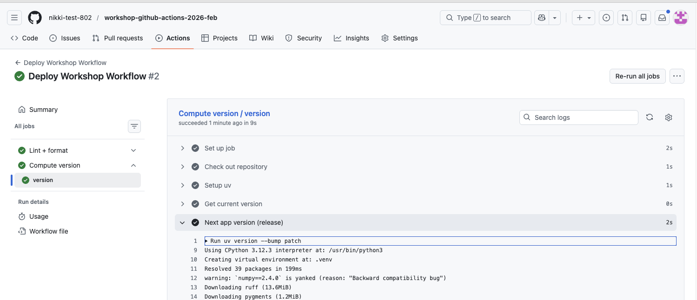

8. The workflow should have executed successfully, indicated by a checkmark


**✅ Verification Checkpoint**

- The Deploy Workshop Workflow run completes successfully
- Both jobs appear in the workflow run:
    - Lint + format
    - Compute version
- Each job shows a green checkmark
- The workflow run has an overall successful status

## Summary

- Created and ran a minimal GitHub Actions workflow
- Defined jobs, permissions, and workflow triggers in deploy.yml
- Added reusable Lint + Format and Version jobs
- Passed information between jobs using outputs
- Observed parallel job execution by default
- Ran the workflow successfully in GitHub

In **Lesson 1**, you built a mental model for how GitHub Actions workflows work and why they matter for reproducible science. In **Lesson 2**, you put that model into practice by defining and running a complete workflow with jobs, permissions, and versioning logic. In **Lesson 3**, we’ll build on that foundation to produce a released version of the code and explore how releases connect code, results, and reproducibility.

> ✨ Pause for Reflection #2 (2–3 min) ✨
> We’ve created a full GitHub Actions workflow using reusable workflows as jobs.
> - **Most transferable piece:** Which job feels easiest to adopt in your own repo this week? Why?
> - **Biggest friction point:** What feels like the main barrier right now?
>     - setup effort, YAML syntax, dealing with lint errors, permissions/tokens, tests not existing, unclear versioning
> - **One small next step:** What’s a “minimum viable CI” you’d actually commit to?
>     - Example: “Just lint on every PR” or “Just compute version + create a release manually.”
> **If you’re stuck:** Write down the one sentence you’d want CI to guarantee (e.g., “main always runs end-to-end without manual steps”).

# Lesson 3: Job dependencies (sequential execution)

Up until now, all of the jobs defined in deploy.yml have executed in parallel. In this lesson, we’ll introduce job dependencies so that workflows run in a controlled, sequential way.

The goal of this lesson is to use those dependencies to create a GitHub release, tying together linting, versioning, and a final release step.

By the end of the lesson, you’ll see how sequential execution allows earlier jobs to gate later ones and how this pattern supports reproducible, released versions of your code.

***Objectives:***

- Define a "Release" job that freezes code at its current state and creates a GitHub release
- Understand how to define job dependencies using `needs` and how to communicate between jobs using `with`
- Define a dependency on the "Release" job so that it requires the "Lint + Format" and "Version" jobs to run and complete before execution
- Pass the `app_version` created in the "Version" job to the "Release" job
- Execute and test the final workflow `deploy.yml` in GitHub

## 👉 **Step 17.** Define a "Release" job

The “Release” job ties a specific snapshot of your code to a version, so you can clearly identify which version produced a given set of results.

Add this to the end of the `deploy.yml` file after the "Version" job:

```yaml
  release:
    name: Release version
    uses: ./.github/workflows/release.yml
```

This will run the "Release" reusable workflow job which tags and creates a GitHub release. A GitHub release is a published snapshot of your repository at a specific point in time, usually tied to a Git tag. It can include:
- A git tag, like: `v0.1.0`
- Release metadata: The title (often the version), Release notes or a change log, marked to indicate latest release or prerelease
- Optional assets: Compiled binaries, compressed archives of the codebase, installers, docs, etc.
- [GitHub releases documentation](https://docs.github.com/en/repositories/releasing-projects-on-github/managing-releases-in-a-repository)

🧰 A release allows you to freeze your code and tag it with a specific version. This release can be included in publications to link specific versions and therefore specific states of your codebase that produces specific results.

A release is a great way to provide reproducibility to your codebase, although it is not as convenient as creating and hosting a Docker container image on the GitHub container repository. The container image can be easily pulled down and executed without having to worry about setting up Python library dependencies.

Let's take a deeper look at the `release.yml`:

```yaml
name: (Internal) Release

on:
  workflow_call:
    inputs:
      app_version:
        type: string
        required: true

permissions:
  contents: write

jobs:
  release:
    runs-on: ubuntu-latest
    steps:
      - name: Check out repository
        uses: actions/checkout@v4
        with:
          token: ${{ secrets.PAT_TOKEN || secrets.GITHUB_TOKEN }}

      - name: Setup uv
        uses: astral-sh/setup-uv@v4

      - name: Bump and commit version
        run: |
          uv version ${{ inputs.app_version }}
          git config user.name "${GITHUB_ACTOR}"
          git config user.email "${GITHUB_ACTOR}@users.noreply.github.com"
          git commit -am "Chore: Bump version to ${{ inputs.app_version }}"
          git push

      - name: Push tag
        run: |
          git config user.name "${GITHUB_ACTOR}"
          git config user.email "${GITHUB_ACTOR}@users.noreply.github.com"
          git tag -a "v${{ inputs.app_version }}" -m "Version ${{ inputs.app_version }}"
          git push origin "v${{ inputs.app_version }}"

      - name: Create GH release
        uses: ncipollo/release-action@v1
        with:
          generateReleaseNotes: true
          name: v${{ inputs.app_version }}
          tag: v${{ inputs.app_version }}

```

This job is set up similarly to the other jobs we have seen so far using the same syntax and components that define a GitHub Actions workflow file.

The "Release" job performs a few tasks in order to create a GitHub release:
1. Defines inputs to the `workflow_call` so that the "Release" job is passed the `app_version` from the "Version" job
2. Checks out the repository using a token:
	- `secrets.PAT_TOKEN` - This is a [personal access token](https://docs.github.com/en/authentication/keeping-your-account-and-data-secure/managing-your-personal-access-tokens) that you would create and save to [GitHub Secrets](https://docs.github.com/en/actions/how-tos/write-workflows/choose-what-workflows-do/use-secrets) (we won't delve into this in this workshop as it covers a more advanced use case)
	- `secrets.GITHUB_TOKEN` - This is a short-lived authentication token that GitHub automatically creates for every workflow run. It lets your GitHub Actions workflow authenticate to the GitHub API as the repository itself. There is no further action needed to use this token.
	- One of these is required because the release step will commit the new version to the codebase
2. Set up `uv` so it is available on the runner (underlying machine running the GitHub workflow)
3. Bump and commit the version: This will set the version to the version created by the "Version" job and commit the changes made to the `pyproject.toml` and `uv.lock` files which track the current version
4. Push tag - Creates and pushes a tag to the GitHub repository. A [tag](https://git-scm.com/book/en/v2/Git-Basics-Tagging) is a named pointer to a specific commit in your repository.
5. Create GH release - Creates the [GitHub release](https://docs.github.com/en/repositories/releasing-projects-on-github/about-releases) with release notes, a name, and a tag (which is the same as the tag created in the previous step)

## 👉 **Step 18.** Update the permissions for the "Release" job

The permissions in the `release.yml` file are:

```yaml
permissions:
  contents: write
```

These permissions allow the GitHub Actions workflow to read and modify repository contents (commits, tags, releases). This way the "Release" job can create a GitHub release.

These permissions need to be propagated to the top-level workflow defined in `deploy.yml` in order for the "Release" job can use them.

Modify the `deploy.yml` file permissions which should look like this from the previous steps:

```yaml
permissions:
  contents: read
```

To:

```yaml
permissions:
  contents: write
```

## 👉 **Step 19.** Define a job dependency and communicate the version

Now that we added the "Release" job, how does it get the version number from the "Version" job and use it to update the version of the project, tag the current commit, and tag the release?

We need to define the dependency between the "Release" job and all other jobs and then we can use that definition to set up the inputs to the "Release" job.

Modify the current "Release" definition in `deploy.yml` to add in `needs` and `with`

```yaml
  release:
    name: Release version
    uses: ./.github/workflows/release.yml
    needs: [lint-and-format, version]
    with:
      app_version: ${{ needs.version.outputs.app_version }}
```

- `needs` defines what other jobs need to run and complete before the current "Release" job can run.
  - The "Release" job requires the "Version" job to complete before it runs as it requires the `app_version` as input but we also set the `lint-and-format` reference as we don't want to create a "Release" without running the "Lint + Format" job on the codebase. This way we know the code is well formatted before freezing it in the release process.
- `with` provides input parameters to the "Release" job and connects the output of the "Version" job to the input of the "Release" job.
  - The value references the `needs` field and in particular the `version` job outputs to retrieve the `app_version` from the "Version" job. Remember we had defined the outputs of the "Version" job like so:

      ```yaml
      on:
        workflow_call:
          outputs:
            app_version:
              description: Computed app version
              value: ${{ jobs.version.outputs.app_version }}
      ```

  - And the inputs of the "Release" job like so:

    ```yaml
    on:
      workflow_call:
        inputs:
          app_version:
            type: string
            required: true
    ```

**Tying it all together**, we:

1) Defined the `app_version` output in the "Version" job
2) Defined the `app_version` input in the "Release" job
3) Defined the `release` job in the `deploy.yml` file and set it's dependency on the "Version" job using the `needs` field
4) Defined the `app_version` input to the "Release" job using `with`

## 👉 **Step 20.** Execute a job conditionally using `if`

We now have a "Lint + Format", "Version", and "Release" jobs. The "Lint + Format" and "Version" jobs execute in parallel while the "Release" job executes sequentially after both jobs are complete. Here is the current definition file:

```yaml
name: Deploy Workshop Workflow

on:
  workflow_dispatch:    # Allow manual triggering of the workflow

permissions:
  contents: write

jobs:
  lint-and-format:
    name: Lint + format
    uses: ./.github/workflows/lint-and-format.yml

  version:
    name: Compute version
    uses: ./.github/workflows/version.yml

  release:
    name: Release version
    uses: ./.github/workflows/release.yml
    needs: [lint-and-format, version]
    with:
      app_version: ${{ needs.version.outputs.app_version }}
```

What if the "Version" job fails to create the `app_version`, would we still want to create a "Release"?

Probably not, as this might create an incomplete release that doesn't accurately capture the current state of the project and the version. This is where the conditional expression `if` comes in.

Add the `if` key to the "Release" job in the `deploy.yml` file so the "Release" job only runs if the "Version" job completed successfully and the `app_version` variable is populated:

```yaml
  release:
    name: Release version
    uses: ./.github/workflows/release.yml
    needs: [lint-and-format, version]
    if: needs.version.result == 'success' && needs.version.outputs.app_version != ''
    with:
      app_version: ${{ needs.version.outputs.app_version }}
```

## 👉 **Step 21.**  Commit and push the updated workflow

We can test the workflow now that you have an updated `deploy.yml` with the "Release" job, dependencies, and `app_version` inputs/outputs defined.

Updated `deploy.yml` file:

```yaml
name: Deploy Workshop Workflow

on:
  workflow_dispatch:    # Allow manual triggering of the workflow

permissions:
  contents: write

jobs:
  lint-and-format:
    name: Lint + format
    uses: ./.github/workflows/lint-and-format.yml

  version:
    name: Compute version
    uses: ./.github/workflows/version.yml

  release:
    name: Release version
    uses: ./.github/workflows/release.yml
    needs: [lint-and-format, version]
    if: needs.version.result == 'success' && needs.version.outputs.app_version != ''
    with:
      app_version: ${{ needs.version.outputs.app_version }}
```

Let's test the workflow by committing, pushing, and executing the workflow.

1. Commit the modified file

```bash
git add .github/workflows/deploy.yml
git commit -m "Add a release step to freeze codebase at a specific version"
```

2. Push the commit up to GitHub

```bash
git push origin main
```

**✅ Verification Checkpoint**

- The `deploy.yml` file includes a Release job
- The Release job:
  - Depends on both Lint + format and Compute version using needs
  - Receives the version via:
      ```bash
      with:
        app_version: ${{ needs.version.outputs.app_version }}
      ```
- Includes a conditional if statement to guard execution
- Workflow permissions allow releases:
    ```bash
    permissions:
      contents: write
    ```
- The updated `deploy.yml` file has been committed and pushed

## 👉 **Step 22.** Execute the updated workflow

1. Go to the GitHub "Actions" tab for the project repository

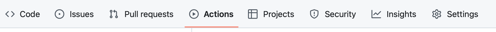

2. Run the "Deploy Workshop Workflow" by clicking through the "Run workflow" buttons. See ["Step 16. Run the GitHub Actions workflow](#-step-16-run-the-github-actions-workflow) for details on how to execute the workflow manually


3. If you click on the workflow, you are directed to the "Summary" page where you will see the jobs executing. You should see the "Lint + Format" and "Compute version" job execute in parallel and then the "Release" job should execute sequentially.

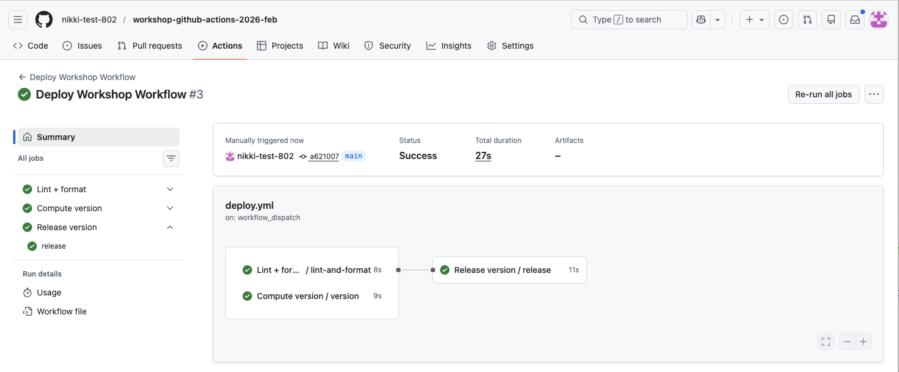

4. Click on the "Release version/release" job, you should see all of the "Release" job steps completed successfully. Feel free to explore each step's logs


5. Verify the release was created. Navigate to the home page of the repository and look for the "Releases" section in the right column

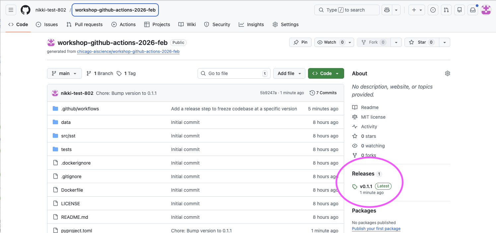

6. Click on the version tag, (e.g., `v0.1.1`) to view the full release details

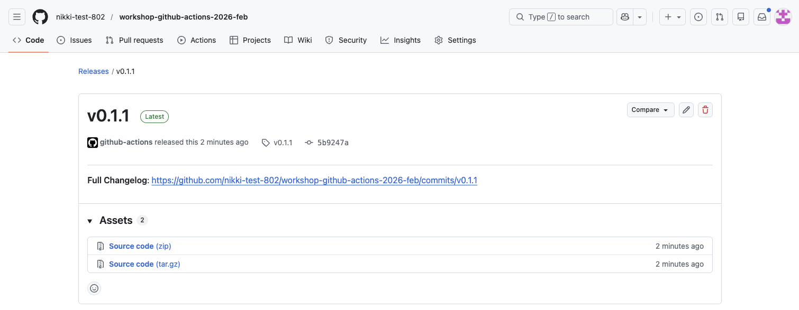
- You can view the full change log of commits or you can download compressed archives of the repository codebase

**✅ Verification Checkpoint**

- The Deploy Workshop Workflow run completes successfully
- Lint + Format and Compute version run first (in parallel)
- Release version runs after both jobs complete
- A new GitHub release is created:
- Visible under the repository’s Releases section
- Tagged with the expected version (e.g., v0.1.1)
- The release page shows release notes and downloadable source archives

## Summary

In **Lesson 1**, you built a mental model for GitHub Actions and explored how workflows can support reproducible scientific code by connecting code changes to automation.

In **Lesson 2**, you put that model into practice by defining and running your own workflows, adding linting, formatting, and versioning to a real repository.

In **Lesson 3**, you introduced job dependencies and releases, tying specific versions of the code to reproducible, citable snapshots. More specifically you:

- Tied a versioned release to a specific state of the code
- Defined a Release job to create a GitHub release
- Updated permissions to allow writing tags and releases
- Added job dependencies so Release runs after Lint + Format and Version
- Guarded the Release job with a conditional on a valid app_version
- Committed the updated workflow to GitHub and executed

Final `deploy.yml` file:

```yaml
name: Deploy Workshop Workflow

on:
  workflow_dispatch:    # Allow manual triggering of the workflow

# 🔍 Checkpoint #3: Update the permissions to aggregate all required from reusable workflow files
permissions:
  contents: write

jobs:
  lint-and-format:
    name: Lint + format
    uses: ./.github/workflows/lint-and-format.yml

  version:
    name: Compute version
    uses: ./.github/workflows/version.yml

  release:
    name: Release version
    uses: ./.github/workflows/release.yml
    # 🔍 Checkpoint #4: Define for any or all of the jobs you define in the deploy.yml file
    needs: [lint-and-format, version]
    if: needs.version.result == 'success' && needs.version.outputs.app_version != ''
    with:
      app_version: ${{ needs.version.outputs.app_version }}
```

🔍 Checkpoint #3: You can use any of the workflows listed as "(Internal)" in the `.github/workflows` directory in your own codebase but you will need to aggregate the permissions across all of these files and define them in the top-level `deploy.yml`. If you use all of the files the permissions would look like this:

  ```yaml
  permissions:
    actions: read
    contents: write
    packages: write
    security-events: read
  ```
> See ["Step 4. Define workflow permissions"](#-step-4-define-workflow-permissions) for info on each of these permissions

🔍 Checkpoint #4: You can modify the `needs` field to include any of the jobs you may define in the `deploy.yml` and to suit your expectations of how the workflow jobs should run.

- For example, you may want to implement security scanning into your workflow, so you add in the "Scan" job (`scan.yml`).
- But you don't want require the "Release" job to run before the code is scanned so you leave that out of the `needs` list.
- Although it is probably a good idea to freeze your codebase on code that does not have vulnerabilities.

> ✨ Pause for Reflection #3 (3 min) ✨
> You now know how to create a release automatically after versioning so your codebase can be referenced precisely.
> 1. What clicked, and what didn’t? Name one concept you feel solid on and one that’s still fuzzy.
> 2. Where would you place this in your real workflow?
>    - On every push to main? Only on tagged commits? Only when a PR is merged?
> 3. What would you want included in your release “artifact set”?
>    - source snapshot only, container image, generated figures, config files, environment lockfile, data manifest

**Lesson 4** builds on this foundation with optional, advanced patterns. It shows how the same workflow structure can be extended to handle more complex execution patterns—running jobs across multiple environments and sharing files between jobs. These features are common in larger projects and collaborative codebases, but they are not required to achieve the core goals of the workshop.

This lesson is best for participants who want to run workflows across multiple environments, automate testing, or capture and reuse files like plots or reports as part of their analysis.

# Lesson 4: Executing on a list using `matrix` and using artifacts - BONUS

This lesson includes some extra bonus content on two other helpful GitHub Actions features:

1) Executing tests on multiple Python versions using `matrix`
2) How to upload and download artifacts to communicate between jobs.

These patterns build on the workflows you’ve already created and show how automation can capture both execution and results.

***Objectives***

- Define a "Test" job that executes on multiple versions of Python using the `matrix` strategy
- Understand how to upload artifacts so other jobs can access files created by job steps
- Understand how to download artifacts in a job and access the downloaded file

## 👉 **Step 23.** Update `pyproject.toml` to include a build system so tests can be run

First (prior to making any changes) pull down the recent changes made to the `main` branch from the previous GitHub Actions workflow executions

```bash
# Pull recent changes to `main` as this may have been modified by the "Release" job
git pull origin main
```

Modify the `pyproject.toml` and replace the contents with this version:

```toml
[build-system]
requires = ["setuptools>=68", "wheel"]
build-backend = "setuptools.build_meta"

[project]
name = "sst"
version = "0.1.1"
description = "A sea surface temperature ML prediction package for workshops (SST + ENSO)."
readme = "README.md"
requires-python = ">=3.10"
license = { text = "MIT" }
authors = [{ name = "Nikki Tebaldi" }]

dependencies = [
  "numpy>=1.26",
  "pandas>=2.1",
  "scikit-learn>=1.3",
  "matplotlib>=3.8",
  "seaborn>=0.13.2",
  "typer>=0.9",
  "ruff>=0.14.10",
  "pytest>=9.0.2",
]

[project.scripts]
sst = "sst.cli:app"

[tool.setuptools]
package-dir = { "" = "src" }
```

This adds a `[build-system]` section which allows the `sst` repository to be installed as a package and used in the execution of the tests. We won't dive into this too far as there could be a whole other workshop on Python packaging.

## 👉 **Step 24.** Define a "Test" job that executes on multiple versions of Python

Update the `deploy.yml` file to include the "Test" job (`test.yml`)

```yaml
test:
  name: Tests
  uses: ./.github/workflows/test.yml
```

Update the "Release" job in the `deploy.yml` to require the `test` job before executing. This way we are creating a release after the successful execution of the tests:

```yaml
  release:
    name: Release version
    uses: ./.github/workflows/release.yml
    needs: [lint-and-format, version, test]
    if: needs.version.result == 'success' && needs.version.outputs.app_version != ''
    with:
      app_version: ${{ needs.version.outputs.app_version }}
```

Let's take a look at the `test.yml` file:

```yaml
name: (Internal) Test

on:
  workflow_call:

jobs:
  test:
    runs-on: ubuntu-latest
    strategy:
      matrix:
        python-version: ["3.10","3.11","3.12"]
    steps:
      - name: Check out repository
        uses: actions/checkout@v4

      - name: Setup uv
        uses: astral-sh/setup-uv@v4
        with:
          version: "latest"
          python-version: ${{ matrix.python-version }}

      - name: Install
        run: uv sync

      - name: Check Python version
        run: uv run python --version

      - name: Execute tests
        run: uv run pytest -q

      - name: Create predictions plot
        run: uv run python -m sst.cli --start 2000-01

      - name: Upload plot
        uses: actions/upload-artifact@v4
        with:
          name: trends-${{ matrix.python-version }}
          path: artifacts/ml_predictions.png
```

The "Test" job executes the unit tests defined in the `tests` directory using `pytest` by:

1. Defining a `strategy` that uses a `matrix` of Python versions. A strategy defines how a job is executed while a matrix is a way to run the same job multiple times with different inputs. See [this documentation](https://docs.github.com/en/actions/how-tos/write-workflows/choose-what-workflows-do/run-job-variations) for more info. This means the "Test" job will be executed three times (one for each Python version)
	- 🧰 This is a great way to test that your code is compatible with multiple Python versions if you want to support more than one version amongst collaborators
2. The job checks out the current code in the repository
3. Then it sets up `uv` using the Python version defined in the matrix, `with` points to the specific matrix element that workflow is executing on : `matrix.python-version`
4. `uv` is then used to install dependencies needed by the tests and then runs the tests using `pytest`
5. The Python version is printed out as a test to ensure the `matrix` definition is working as intended
6. We will discuss the creation and upload of the predictions plot in the section on "Artifacts"

🧰 Step 3 works well for our example because we use `uv` to run each test command. If you want to make a specific Python version available to all installed tools on the runner use the `actions.setup-python@v5`:

```yaml
- name: Set up Python
  uses: actions/setup-python@v5
  with:
    python-version: ${{ matrix.python-version }}
```

## 👉 **Step 25.** Commit, push, and execute the updated workflow

We can test the updated `deploy.yml` file to see if multiple "Test" jobs are run on the three defined Python versions.

Full `deploy.yml` file:

```yaml
name: Deploy Workshop Workflow

on:
  workflow_dispatch:    # Allow manual triggering of the workflow

permissions:
  contents: write

jobs:
  lint-and-format:
    name: Lint + format
    uses: ./.github/workflows/lint-and-format.yml

  version:
    name: Compute version
    uses: ./.github/workflows/version.yml

  release:
    name: Release version
    uses: ./.github/workflows/release.yml
    needs: [lint-and-format, version]
    if: needs.version.result == 'success' && needs.version.outputs.app_version != ''
    with:
      app_version: ${{ needs.version.outputs.app_version }}

  test:
    name: Tests
    uses: ./.github/workflows/test.yml

```

1. Commit and push recent changes to GitHub

```yaml
# Commit and push recent changes
git add .github/workflows/deploy.yml pyproject.toml
git commit -m "Define a 'Test' job to execute on multiple Python versions"

# Push recent changes up to GitHub
git push origin main
```

2. Test the workflow in GitHub. See ["Step 16. Run the GitHub Actions workflow"](#-step-16-run-the-github-actions-workflow) for details on how to run the workflow.


3. Once the workflow has executed, review the "Test" jobs that were created and executed by clicking on "3 jobs completed" > "Tests/ test (3.12)"

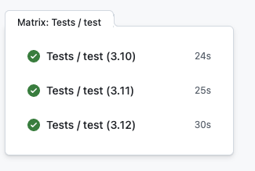

4.  Look at the logs for the "Check Python version" step and see that the Python version was: `Python 3.12.3`


Feel free to view the logs for the other versions to make sure things look correct.

**✅ Verification Checkpoint**

- The Deploy Workshop Workflow runs successfully
- A Test job executes multiple times using a matrix:
    - Separate runs for Python 3.10, 3.11, and 3.12
- Each Test job:
    - Prints the correct Python version in the logs
    - Completes successfully with a green checkmark
- The workflow summary shows multiple Test jobs created from a single definition

## 👉 **Step 26.** Download the artifacts created in the "Test" jobs

In step 15, we covered how to run tests on multiple Python versions and each of these versions uploads a plot created by the execution of the `sst` program.

"Test" job definition highlight of the upload operation:

```yaml
      - name: Upload plot
        uses: actions/upload-artifact@v4
        with:
          name: trends-${{ matrix.python-version }}
          path: artifacts/ml_predictions.png
```

The `actions/upload-artifact@v4` takes files created during a job and saves them as downloadable artifacts attached to that workflow run. If you go back to the "Summary" page of the GitHub Actions workflow you executed in step 16, you should see "Artifacts" listed at the bottom of the summary.


You can download them and review the plots. But what if you wanted to use these files in another GitHub Actions workflow job? Let's create a toy example that downloads the artifacts to a job (`download-artifact.yml`) and lists the available files after download.

But first let's pull down any changes made by the "Release" job prior to making any file modifications in the repo:

```bash
git pull origin main    # Pull down any release changes
```

Add the "Download Test Artifacts" job to the `deploy.yml` file:

```yaml
  download-artifacts:
    name: Download test artifacts
    needs: test
    uses: ./.github/workflows/download-artifact.yml
```

- The `needs` is critical as this job needs to run after the artifacts have been created and uploaded

Let's review the `download-artifact.yml` file:

```yaml
name: (Internal)Download Test Artifacts

on:
  workflow_call:

jobs:
  download-artifacts:
    runs-on: ubuntu-latest
    steps:
      - name: Download artifact for Python 3.10
        uses: actions/download-artifact@v4
        with:
          name: trends-3.10
          path: artifacts/python-3.10

      - name: Download artifact for Python 3.11
        uses: actions/download-artifact@v4
        with:
          name: trends-3.11
          path: artifacts/python-3.11

      - name: Download artifact for Python 3.12
        uses: actions/download-artifact@v4
        with:
          name: trends-3.12
          path: artifacts/python-3.12

      - name: List downloaded artifacts
        run: |
          echo "Downloaded artifacts:"
          find artifacts -type f -name "*.png" || echo "No PNG files found"
          ls -la artifacts/*/ || echo "No artifact directories found"

```

- This workflow job uses the `actions/download-artifact@v4` GitHub Action to download the plots from the previous test jobs
- `with` defines the `name` of the plot and sets the `path` to download the plot to
- The final step lists the available downloads to show the plots have been downloaded

## 👉 **Step 27.** Commit, push, and execute the updated workflow

Let's test the final workflow to see if the plots get downloaded.

Final `deploy.yml` file:

```yaml
name: Deploy Workshop Workflow

on:
  workflow_dispatch:    # Allow manual triggering of the workflow

permissions:
  contents: write

jobs:
  lint-and-format:
    name: Lint + format
    uses: ./.github/workflows/lint-and-format.yml

  version:
    name: Compute version
    uses: ./.github/workflows/version.yml

  test:
    name: Tests
    uses: ./.github/workflows/test.yml

  download-artifacts:
    name: Download test artifacts
    needs: test
    uses: ./.github/workflows/download-artifact.yml

  release:
    name: Release version
    uses: ./.github/workflows/release.yml
    needs: [lint-and-format, version, test]
    if: needs.version.result == 'success' && needs.version.outputs.app_version != ''
    with:
      app_version: ${{ needs.version.outputs.app_version }}

```
- Note the order has been changed so that the steps are listed in the order they execute
- The `download-artifacts` and `release` job can execute in parallel as they don't require any data from each other to execute

1. Commit and push the recent modifications to GitHub

```yaml
git add .github/workflows/deploy.yml
git commit -m "Add toy example to download artifacts from Test jobs"
git push origin main
```

2. Execute the workflow in GitHub, see [Step 16. Run the GitHub Actions workflow](#-step-16-run-the-github-actions-workflow) for details on how to execute


3. After execution completes, verify the plots were downloaded by clicking on "Downlo.../download-artifacts and viewing the logs for the "List downloaded artifacts" step

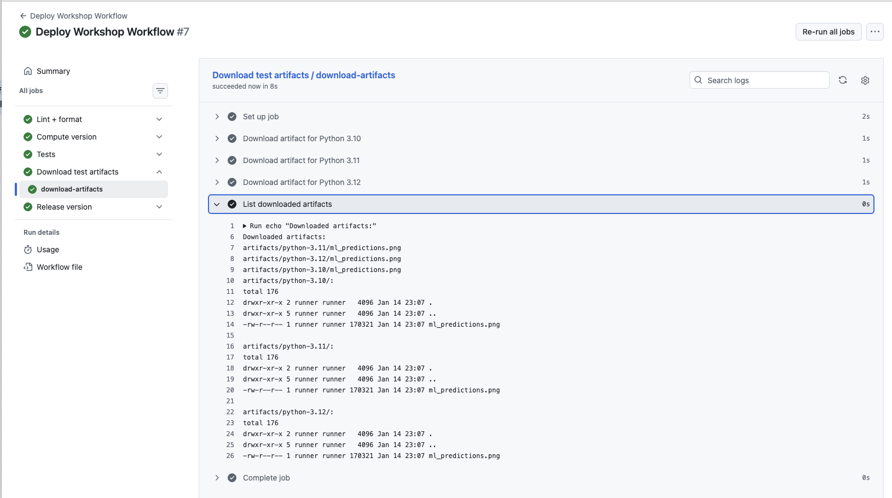

* The "Download Test Artifacts" job downloaded all three `ml_predictions.png` plots for each Python version executed by the test

**✅ Verification Checkpoint**

- The **Download test artifacts job** runs after the **Test** jobs
- The job completes successfully with a green checkmark
- The job logs list downloaded files:
    - One plot for each Python version (e.g., `python-3.10`, `python-3.11`, `python-3.12`)
- The listed files `include ml_predictions.png` in each directory

## Summary

In this bonus lesson, you extended your workflow to run jobs across multiple environments and share files between jobs. Using matrix and artifacts, you saw how GitHub Actions can capture both execution and results.

**Key outcomes:**

- Ran tests across multiple Python versions using matrix
- Uploaded result files as artifacts during test runs
- Downloaded artifacts in a downstream job
- Verified one plot per Python version was retrieved successfully

This pattern shows how workflows can automate not just code checks, but also the generation and reuse of scientific outputs.

Final `deploy.yml`

```yaml
name: Deploy Workshop Workflow

on:
  workflow_dispatch:    # Allow manual triggering of the workflow

permissions:
  contents: write

jobs:
  lint-and-format:
    name: Lint + format
    uses: ./.github/workflows/lint-and-format.yml

  version:
    name: Compute version
    uses: ./.github/workflows/version.yml

  test:
    name: Tests
    uses: ./.github/workflows/test.yml

  download-artifacts:
    name: Download test artifacts
    needs: test
    uses: ./.github/workflows/download-artifact.yml

  release:
    name: Release version
    uses: ./.github/workflows/release.yml
    needs: [lint-and-format, version, test]
    if: needs.version.result == 'success' && needs.version.outputs.app_version != ''
    with:
      app_version: ${{ needs.version.outputs.app_version }}
```

> ✨ Pause for Reflection #4 (2–3 min) ✨
> You’ve seen two powerful add-ons: matrix testing and artifacts.
> 1. Matrix: Would testing multiple Python versions help your collaboration, or just add noise? Why?
> 2. Artifacts: What’s one file you wish your workflow produced automatically every run?
    - e.g., a plot, metrics JSON, model evaluation report, parameter summary, logs, a paper-ready figure

# Lessons Summary

**Lesson 1: GitHub Actions and reproducible science**
You built a mental model for GitHub Actions and explored how CI/CD concepts apply to scientific code. By reviewing a complete example, you learned how workflows can connect code changes to automated execution and reproducible results.

**Lesson 2: Defining and running workflows**
You moved from concepts to practice by creating and running your own GitHub Actions workflow. You defined workflow triggers, permissions, and jobs, and added automated linting, formatting, and versioning to a real repository.

**Lesson 3: Job dependencies and releases**
You introduced sequential execution using job dependencies and conditionals, and added a release step to freeze the code at a specific version. This tied versioned code to GitHub releases, providing a reproducible, citable reference for results.

**Lesson 4 (Bonus): Matrix execution and artifacts**
You extended the workflow to run tests across multiple environments using matrix and to share files between jobs using artifacts. These patterns showed how workflows can capture not just code, but also execution outputs such as plots or reports.

Together, these lessons demonstrate how GitHub Actions can support reproducible science by automating execution and tying results to versioned code. The goal is to leave with practical patterns you can reuse, not just syntax to memorize.

## Key takeaways

- GitHub Actions workflows provide a practical way to automate common tasks (linting, testing, versioning, releasing) in scientific codebases.
- A workflow defines when automation runs, jobs define what runs, and steps define how it runs.
- A workflow is a YAML file that defines *when* automation runs and *what* steps are executed.
- Workflows are made up of jobs, jobs are made up of steps, and steps run either commands or reusable actions.
- Job dependencies and conditional execution allow you to control when tasks run and prevent incomplete or invalid releases.
- Versioning and releases provide a clear way to tie specific states of the codebase to results used in publications.
- **Reproducible releases turn automation into a stable reference point, linking code, environment, and results so analyses can be rerun and cited.**

# References

***Linked in this workshop***

- **About code scanning**
    [https://docs.github.com/en/code-security/code-scanning/introduction-to-code-scanning/about-code-scanning](https://docs.github.com/en/code-security/code-scanning/introduction-to-code-scanning/about-code-scanning)
    Overview of GitHub’s code scanning feature and how security analysis is integrated into workflows.

- **About releases**
    [https://docs.github.com/en/repositories/releasing-projects-on-github/about-releases](https://docs.github.com/en/repositories/releasing-projects-on-github/about-releases)
    Explains GitHub releases and how they are used to package and distribute specific versions of a repository.

- **Billing for GitHub Actions**
    [https://docs.github.com/en/billing/concepts/product-billing/github-actions](https://docs.github.com/en/billing/concepts/product-billing/github-actions)
    Describes how GitHub Actions usage is billed and what limits apply to different repository types.

- **Events that trigger workflows**
    [https://docs.github.com/en/actions/reference/workflows-and-actions/events-that-trigger-workflows](https://docs.github.com/en/actions/reference/workflows-and-actions/events-that-trigger-workflows)
    Lists the events (such as `push`, `pull_request`, and `workflow_dispatch`) that can start a workflow.

- **Git basics – tagging**
    [https://git-scm.com/book/en/v2/Git-Basics-Tagging](https://git-scm.com/book/en/v2/Git-Basics-Tagging)
    Explains Git tags and how they are used to mark specific points in a repository’s history.

- **GitHub-hosted runners**
    [https://docs.github.com/en/actions/using-github-hosted-runners/about-github-hosted-runners](https://docs.github.com/en/actions/using-github-hosted-runners/about-github-hosted-runners)
    Describes the virtual machines provided by GitHub to run workflows and the environments they support.

- **GitHub Pages**
    [https://docs.github.com/en/pages](https://docs.github.com/en/pages)
    Documentation for publishing static sites directly from a GitHub repository.

- **HEP Software Foundation (HSF) CI/CD with GitHub Actions – Understanding YAML**
    [https://hsf-training.github.io/hsf-training-cicd-github/04-understanding-yaml/](https://hsf-training.github.io/hsf-training-cicd-github/04-understanding-yaml/)
    Introduces YAML syntax and structure in the context of CI/CD workflows.

- **HEP Software Foundation (HSF) CI/CD with GitHub Actions – Understanding YAML and CI**
    [https://hsf-training.github.io/hsf-training-cicd-github/05-understanding-yaml-and-ci/](https://hsf-training.github.io/hsf-training-cicd-github/05-understanding-yaml-and-ci/)
    Builds on YAML basics and connects them to continuous integration concepts using GitHub Actions.

- **Managing personal access tokens (PATs)**
    [https://docs.github.com/en/authentication/keeping-your-account-and-data-secure/managing-your-personal-access-tokens](https://docs.github.com/en/authentication/keeping-your-account-and-data-secure/managing-your-personal-access-tokens)
    Explains how to create and manage personal access tokens for authentication in GitHub workflows.

- **Using secrets in GitHub Actions**
    [https://docs.github.com/en/actions/how-tos/write-workflows/choose-what-workflows-do/use-secrets](https://docs.github.com/en/actions/how-tos/write-workflows/choose-what-workflows-do/use-secrets)
    Describes how to store and use sensitive values securely in GitHub Actions workflows.

- **Using a matrix strategy**
    [https://docs.github.com/en/actions/how-tos/write-workflows/choose-what-workflows-do/run-job-variations](https://docs.github.com/en/actions/how-tos/write-workflows/choose-what-workflows-do/run-job-variations)
    Explains how to run the same job across multiple configurations, such as different Python versions.

***Further reading***

- **Docker Build and Push GitHub Action**
    [https://github.com/docker/build-push-action](https://github.com/docker/build-push-action)
    Reference documentation for building and publishing Docker images within GitHub Actions workflows.

- **GitHub Actions documentation (overview)**
    [https://docs.github.com/actions](https://docs.github.com/actions)
    The main entry point for GitHub Actions documentation, covering workflows, jobs, and actions.

- **GitHub Actions permissions and `GITHUB_TOKEN`**
    [https://docs.github.com/en/actions/security-guides/automatic-token-authentication](https://docs.github.com/en/actions/security-guides/automatic-token-authentication)
    Explains how permissions are scoped for workflows and how the `GITHUB_TOKEN` is used securely.

- **GitHub Packages and GitHub Container Registry (GHCR)**
    [https://docs.github.com/packages](https://docs.github.com/packages)
    Documentation for publishing and managing packages and container images on GitHub.

- **Reusable workflows in GitHub Actions**
    https://docs.github.com/actions/using-workflows/reusing-workflows
    Describes how to create workflows that can be called by other workflows to reduce duplication.

- **`pyproject.toml` specification (PEP 621)**
    [https://peps.python.org/pep-0621/](https://peps.python.org/pep-0621/)
    Defines standardized project metadata used by modern Python tooling.

- **The Carpentries**
    [https://carpentries.org/](https://carpentries.org/)
    Guidance on evidence-based teaching practices and lesson design used throughout the workshop.

- **`uv` Python package manager**
    [https://docs.astral.sh/uv/](https://docs.astral.sh/uv/)
    Documentation for the dependency and version management tool used in the workshop.

# Appendix

## Install Git on Windows, macOS, and Linux

This workshop requires Git to be installed on your local machine. Follow the instructions below for your operating system.

---

### A. Installing Git on **Windows**

#### Option 1: Install Git for Windows (recommended)

1. Open a web browser and go to:
   https://git-scm.com/download/win

2. The installer (`Git-<version>-64-bit.exe`) should download automatically.
   If not, click **“Click here to download manually.”**

3. Run the installer and follow the setup wizard.
   - You can accept the **default options** for almost all steps.
   - When asked about the default editor, you may choose:
     - **Nano** (simplest), or
     - **VS Code** (recommended if you already use it).

4. When installation is complete, open **Git Bash** (installed with Git).

5. Verify the installation by running:
   ```bash
   git --version
   ```
   You should see a version number (e.g., `git version 2.44.0`).

##### Notes for Windows users
- **Git Bash** provides a Unix-like terminal and is recommended for this workshop.
- Git will also be available from PowerShell and Command Prompt after installation.

---

### B. Installing Git on **macOS**

#### Option 1: Install via Xcode Command Line Tools (simplest)

1. Open **Terminal** (Applications → Utilities → Terminal).

2. Run:
   ```bash
   git --version
   ```

3. If Git is not installed, macOS will prompt you to install the **Command Line Developer Tools**.
   - Click **Install** and follow the prompts.

4. After installation completes, verify:
   ```bash
   git --version
   ```

#### Option 2: Install using Homebrew (recommended for developers)

If you already use Homebrew:

1. Install Git:
   ```bash
   brew install git
   ```

2. Verify the installation:
   ```bash
   git --version
   ```

---

### C. Installing Git on **Linux**

#### Option 1: Installing Git on **Ubuntu / Debian**

1.  Open a terminal.

2.  Update your package index:

    ``` bash
    sudo apt update
    ```

3.  Install Git:

    ``` bash
    sudo apt install git
    ```

4.  Verify the installation:

    ``` bash
    git --version
    ```

    You should see a version number (for example, `git version 2.43.0`).

---

#### Option 2: Installing Git on **Fedora / RHEL / Rocky / AlmaLinux**

1.  Open a terminal.

2.  Install Git:

    ``` bash
    sudo dnf install git
    ```

3.  Verify the installation:

    ``` bash
    git --version
    ```

---

#### Option 3: Installing Git on **Arch Linux / Manjaro**

1.  Open a terminal.

2.  Install Git:

    ``` bash
    sudo pacman -S git
    ```

3.  Verify the installation:

    ``` bash
    git --version
    ```

---

#### Option 4: Installing Git on **openSUSE**

1.  Open a terminal.

2.  Install Git:

    ``` bash
    sudo zypper install git
    ```

3.  Verify the installation:

    ``` bash
    git --version
    ```

---

### D. Post-installation (All Platforms)

After installing Git, configure your name and email (required for commits):

```bash
git config --global user.name "Your Name"
git config --global user.email "your.email@example.com"
```

You can confirm your settings with:
```bash
git config --global --list
```

---

### E. Troubleshooting

- If `git --version` does not work:
  - Restart your terminal and try again.
  - On Windows, ensure you are using **Git Bash**.
- If problems persist, see:
  https://git-scm.com/book/en/v2/Getting-Started-Installing-Git


## Create a GitHub Personal Access Token

This appendix walks through creating a token and storing it in your repository so GitHub Actions can authenticate when it needs to push commits/tags or create releases.

GitHub supports **fine-grained** tokens (recommended) and **classic** tokens.

---

### Option 1 (recommended): Fine-grained personal access token

1. Go to GitHub → **Settings**
2. Navigate to **Developer settings** → **Personal access tokens** → **Fine-grained tokens**
3. Click **Generate new token**
4. Set:
   - **Token name**: something recognizable (e.g., `workshop-actions-release`)
   - **Expiration**: choose an expiration that covers the workshop (e.g., 7–30 days)
   - **Resource owner**: your GitHub account
   - **Repository access**: select **Only select repositories** and choose the workshop repo (or the repo you will use)
5. Under **Repository permissions**, set:
   - **Actions** → **Read and write** (Under "Access" next to the permission)
   - **Contents** → **Read and write** (Under "Access" next to the permission)
6. Click **Generate token**
7. Copy the token immediately and store it somewhere secure (you won’t be able to view it again).

---

### Option 2: Classic personal access token

1. Go to GitHub → **Settings**
2. Navigate to **Developer settings** → **Personal access tokens** → **Tokens (classic)**
3. Click **Generate new token (classic)**
4. Set an **expiration**
5. Select scopes:
   - **`repo`** (required for committing/pushing, tags, and releases in private repos; also works for public repos)
   - **`workflow`** (required to **add/update workflow files** under `.github/workflows/`)
6. Click **Generate token**
7. Copy the token immediately and store it somewhere secure.

🧰 **When do you need the `workflow` scope?**

Only if the workflow (or a script run by the workflow) will **create or modify files inside `.github/workflows/`**. For this workshop’s core release flow (bump version, push tag, create release), `repo` is typically sufficient.

> Security note: Use the minimum permissions needed and set an expiration. Treat your PAT like a password.

References:
- Managing personal access tokens: https://docs.github.com/en/authentication/keeping-your-account-and-data-secure/managing-your-personal-access-tokens
