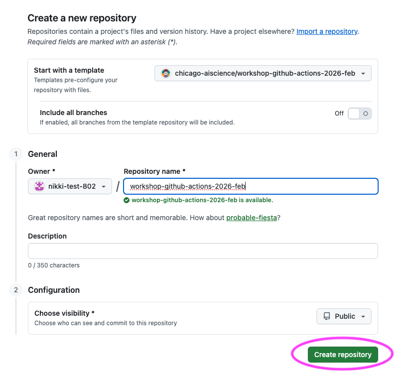
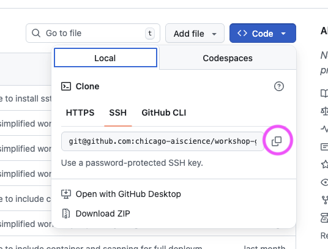
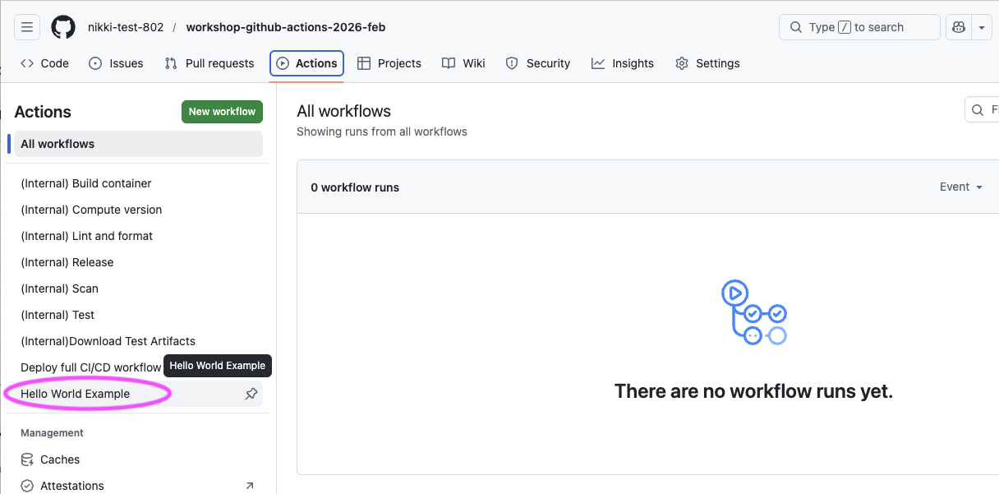
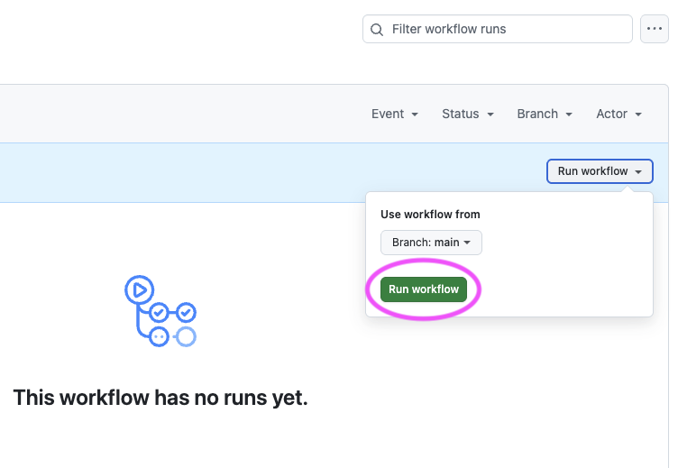
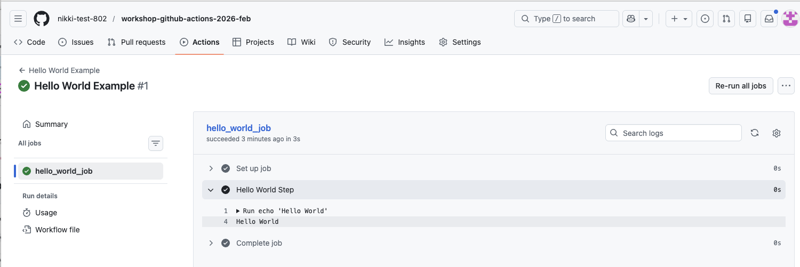
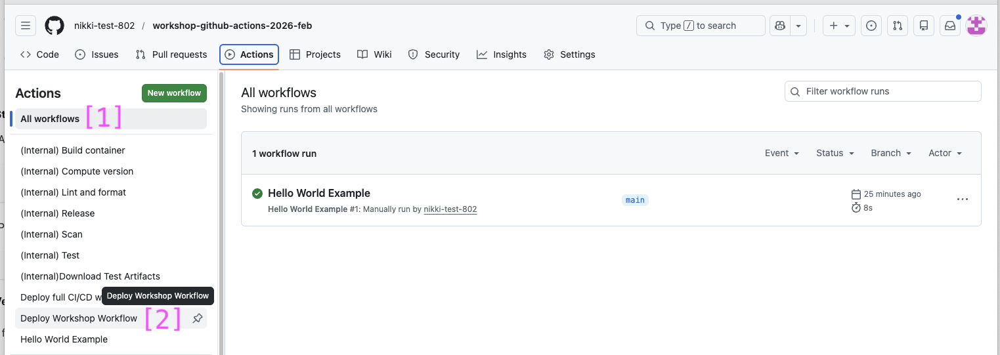
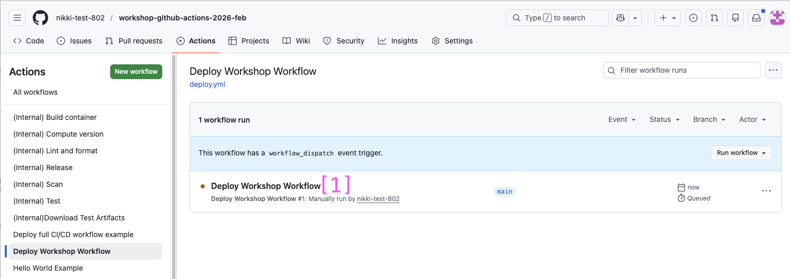
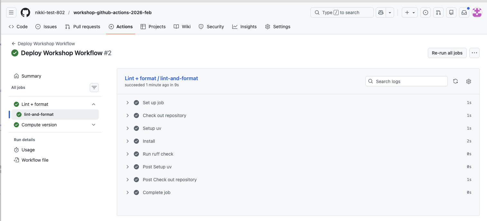

# Lesson 2: Getting started with a workflow

This lesson will cover how to get started with GitHub Actions starting with some background information on YAML and the structure of GitHub Action workflow files. The lesson will then cover how to create your first GitHub Action workflow definition file and introduce key components as we add various operations to the file.

This lesson also marks the start of the hands-on portion of the workshop and focuses on this GitHub repository. The repository was created by distilling the larger example introduced in Lesson One into a simpler, more focused workflow. Its goal is to help build a solid foundation in GitHub Actions before layering on more complexity.

***Objectives:***

- Create a `pyproject.toml` file to support project versioning
- Define an initial GitHub Actions workflow file with a name, when it should be triggered, and permissions
- Define a "Lint + Format" job that lints and formats the codebase
- Define a "Version" job that provides versioning for the project

## YAML and defining a GitHub Action workflow

GitHub Action workflows are defined in YAML:

- YAML is a human-readable data serialization standard.
- It includes a syntax that relies on indentation and key-value pairs.
- It represents data structures like lists (sequences) and dictionaries (mappings).

🧰 A YAML file indents can be defined with tabs or spaces but by convention it is best to define indents with two spaces.

Example list

```yaml
fruits:
  - oranges
  - apples
  - bananas
```

Example dictionary

```yaml
fruit:
    name: orange
    price: 2.0
    amount: 500
```

See [the "Continuous Integration / Continuous Deployment tutorial" YAML page](https://hsf-training.github.io/hsf-training-cicd-github/04-understanding-yaml/index.html) for helpful tips on working with YAML.

A GitHub Actions workflow is a YAML file that tells GitHub what to do automatically when something happens in your repository.

## Common GitHub workflow terminology and definitions:

| Term                  | What it means (plain language)                                        | Example                               |
| --------------------- | --------------------------------------------------------------------- | ------------------------------------- |
| Workflow              | A YAML file that defines automated tasks to run in a repository.      | `.github/workflows/deploy.yml`        |
| Action                | A reusable unit of code that performs a single task.                  | `actions/checkout@v4`                 |
| Job                   | A group of steps that run together on the same runner.                | `jobs: test:`                         |
| Step                  | An individual command or action executed as part of a job.            | `- run: pytest`                       |
| Runner                | A virtual machine that runs a job.                                    | `runs-on: ubuntu-latest`              |
| Trigger               | An event that starts a workflow.                                      | `on: push`                            |
| `needs`               | Specifies which job(s) must finish successfully before this job runs. | `needs: build`                        |
| `if`                  | A conditional expression that determines whether a job or step runs.  | `if: github.ref == 'refs/heads/main'` |
| `name`                | A human-readable label shown in the Actions UI.                       | `name: Run tests`                     |
| `id`                  | A unique identifier used to reference a step or job.                  | `id: build`                           |
| `run`                 | Executes a shell command directly on the runner.                      | `run: pytest -q`                      |
| `uses`                | Runs a prebuilt action or reusable workflow.                          | `uses: actions/checkout@v4`           |
| `with`                | Provides input parameters to an action or reusable workflow.          | `with: python-version: "3.11"`        |
| Environment variables | Key–value pairs available to jobs and steps.                          | `env: MY_VAR=value`                   |

🧰 **Workflows contain jobs → jobs contain steps → steps run actions or commands.** Reusable workflows are workflows that call other workflows to avoid repetition.

Remember, workflows define _when_ automation runs, jobs define _what_ runs, steps define _how_ it runs, and actions package reusable functionality that steps can run.

**General structure**

```yaml
name: <name of your workflow>

on: <event or list of events>

jobs:
  job_1:
    name: <name of the first job>
    runs-on: <type of machine to run the job on>
    steps:
      - name: <step 1>
        run: |
          <commands>
      - name: <step 2>
        run: |
          <commands>
  job_2:
    name: <name of the second job>
    runs-on: <type of machine to run the job on>
    steps:
      - name: <step 1>
        run: |
          <commands>
      - name: <step 2>
        run: |
          <commands>
```
*Taken from the CI/CD workshop delivered by the HSF and located at: https://hsf-training.github.io/hsf-training-cicd-github/05-understanding-yaml-and-ci/index.html*

## Define a 'hello world' example

Before we dive too deeply into the workshop workflow, let's first explore a basic GitHub Actions workflow definition but first we have to set up a `git` repository.

### 👉 **Step 1.** Create a new repository

Create a new repository from the template workshop repo. The following steps were taken from ["Creating a repository from a template"](https://docs.github.com/en/repositories/creating-and-managing-repositories/creating-a-repository-from-a-template#creating-a-repository-from-a-template) GitHub documentation.

*Note - This repository is the simplified version of the larger reference example mentioned in Lesson One.*

1. Navigate to the main page of the repository: https://github.com/chicago-aiscience/workshop-github-actions-2026-feb
2. Above the file list and to the right next to the repository name, click "Use this template"


3. Select "Create a new repository"


4. Leave the "Start with a template" and "Include all branches" fields set to their defaults
4. Check that your GitHub username is listed in the "Owner" dropdown menu
5. Type a name for your repository: `workshop-github-actions-2026-feb`
6. Include a description if you would like
7. Leave the "Choose visibility" field set to "Public"
8. Click "Create repository"



9. Copy the link to clone your new repository by copying the "SSH" link from the "<> Code" dropdown



10. Pick a location on your computer (replacing `<code-location>` with a path on your computer) and clone the repository you just created (replacing `<paste-link-here>` with the copied link)
    ```bash
    cd <code-location>
    git clone <paste-link-here>
    ```
11. Navigate to the workshop directory by running the following command:
    ```bash
    cd workshop-github-actions-2026-feb
    ```

**✅ Verification Checkpoint**

- You have a GitHub repository named `workshop-github-actions-2026-feb` under your GitHub account
- You have successfully cloned the repository to your computer
- Running the following command from the repository root works without errors:

```bash
git status
```

(step-2-create-a-definition-file)=
### 👉 **Step 2.** Create a definition file

Now we can create the file that defines the GitHub Actions workflow, we will call the file `hello.yml`.

**Create a file (terminal)**

If you are using a Mac or Linux operating sytem you can run the `touch` command on the terminal. Make sure to run this command from the root of the GitHub repository to create the file:

```bash
touch .github/workflows/hello.yml
```

🧰 Note on file creation: Any step that asks you to create a file can be done directly in your IDE instead of using the terminal. Creating files via the editor works the same on Windows, macOS, and Linux and is recommended for this workshop.

**Create a file (IDE)**

If your are using a Windows operating system or do not want to run a command in terminal you can use an IDE to create the file:

1. Open the repository folder in your IDE (VS Code, PyCharm, etc.)
2. In the file explorer: Create a new file (right-click → New File)
3. Name the file exactly as specified, (e.g. `hello.yml`)
4. Save the file

### 👉 **Step 3.** Define the name and trigger for the workflow

Open up the `hello.yml` file in your IDE and type in the following:

```yaml
name: Hello World Example

on:
  workflow_dispatch:    # Allow for manual trigger
```

- `name`: Defines the name of the entire workflow
- `on`: Defines what will trigger the workflow, for now we will only allow for manual execution

### 👉 **Step 4.** Define the jobs and how the workflow will execute

With the `hello.yml` still open in your IDE, type the following at the end of the file:

```yaml
jobs:
  hello_world_job:
    runs-on: ubuntu-latest
    steps:
    - name: Hello World Step
      run: echo 'Hello World'
```

- `jobs` defines all of the jobs that will be run and they run in parallel by default. We will explore sequential execution in a little bit.
- `runs-on` indicates the underlying virtual machine the workflow will run on
- `steps` details the steps which defines the individual commands or actions that will be taken in the workflow
- `name` provides a human readable name for the job
- `run` executes the command on the virtual machine defined by `runs-on`

### 👉 **Step 5.** Commit and push the file up to GitHub

The final workflow file should like this:

```yaml
name: Hello World Example

on:
  workflow_dispatch:    # Allow for manual trigger

jobs:
  hello_world_job:
    runs-on: ubuntu-latest
    steps:
    - name: Hello World Step
      run: echo 'Hello World'
```

1. Add and commit the `hello.yml` file to the `git` repository on the `main` branch:

```bash
git add .github/workflows/hello.yml
git commit -m "GitHub Actions workflow hello world example"
```

2. Push the commit up to the GitHub repository

```bash
git push origin main
```

*Note: There can be issues pushing to GitHub if you haven't set and used your Personal Access Token (PAT) previously. We will hold to work out any issues.*

**✅ Verification Checkpoint**

- A file exists at `.github/workflows/hello.yml`
- The file has been committed and pushed to GitHub

### 👉 **Step 6.** Run the GitHub action

Now that you have a GitHub Actions workflow defined and it is pushed up to GitHub, we can manually trigger the workflow by navigating to the repository on GitHub.

1. Navigate to the repository under your GitHub account: `https://github.com/<your-github-username>?tab=repositories`

    a. Replace `<your-github-username>` with your GitHub username
    b. Click on the repository


2. Click on "Actions" on the repository home page


3. The page should display a message: "There are no workflow runs yet." Click on the "Hello World Example" in the left column



4. Let's manually trigger the workflow by clicking on "Run workflow" > Leave the branch set to `main` and click on "Run workflow"



5. You should see the "Hello World Example" running in the main section of the Actions page. You can click on the running example to see more details.


6. You should see a "Summary" of all the details of the executing workflow. You can click on the `hello_world_job` to see logs for each job step's execution.


7. View the logs for the "Hellow World Step" to see the "Hello World" texted printed to the log.



You’ve now successfully run your first GitHub Actions workflow. Next, we’ll dig into the core workshop components and start using workflows to do something more meaningful for reproducible scientific code.

**✅ Verification Checkpoint**

- The Hello World Example workflow run completed successfully
- The job hello_world_job shows a green checkmark
- The workflow logs include the line:
    ```bash
      Hello World
    ```
- If you see this output in the logs, the workflow ran successfully.

## The workshop project and version

For this workshop we will consider a GitHub Action workflow with three steps plus one bonus step:

1. Lint and format
2. (Optional Bonus) Test
3. Version
4. Release

In order for the version step to execute correctly, we need a way to indicate a version number. A minimal `pyproject.toml` file will assist in this.

**Brief note on project structure**

The GitHub Actions workflow definition is broken into reusable workflows where there is one workflow per job. We will refer to these reusable workflows as jobs in the context of this workshop as they are intended for you to be able to plug into your own codebases and use. We will indicate when you can re-use a workflow job and what inputs and permissions are required with a 🔍 symbol.

🧰 It should be noted that typically, the jobs are all defined in a single file and there is no need to break these up by job unless you want to reuse specific definition files across repositories and projects. Example file without reusable workflow "jobs": https://github.com/chicago-aiscience/workshop-sst/blob/main/.github/workflows/deploy.yml

🧰 Note on terminology: In GitHub Actions, a _reusable workflow_ is technically a workflow that calls another workflow. In this workshop, we refer to these reusable workflows as “jobs” because they behave like plug-in jobs you can reuse across repositories.

### 👉 **Step 7.** Define a `pyproject.toml`

The `pyproject.toml` file is a single place to define a Python project and how it should be installed and run. It defines details like:

- The name of your project
- The version of your project
- What version of Python is required
- What dependencies your project uses
- (Optionally) How to run as a command-line tool

*Let's add a `pyproject.toml` file to the repository.*

Here is a minimal definition:

```toml
[project]
name = "sst"
version = "0.1.0"
description = "A sea surface temperature ML prediction package for workshops (SST + ENSO)."
readme = "README.md"
requires-python = ">=3.10"
license = { text = "MIT" }
authors = [{ name = "Nikki Tebaldi" }]

dependencies = [
  "numpy>=1.26",
  "pandas>=2.1",
  "scikit-learn>=1.3",
  "matplotlib>=3.8",
  "seaborn>=0.13.2",
  "typer>=0.9",
  "ruff>=0.14.10",
  "pytest>=9.0.2",
]

[project.scripts]
sst = "sst.cli:app"
```

****Note the `version` key as that is important for the version GitHub Actions job.***

🔍 Checkpoint #1: You can use the following examples as a template to create your own `pyproject.toml` for your codebase and fill in the necessary details for the project `[project]`, dependencies, and script entry point `[project.scripts]`.

- Then you can implement versioning for your own projects. The minimum requirement for this workshop is to have a `version` key specified and an entrypoint `[project.scripts]` defined for testing.

### 👉 **Step 8.** Create the `pyproject.toml` file and add it to the Git repository:**

1. Create the file:
    ```bash
    touch pyproject.toml
    ```
    *a. If you cannot run the `touch` command (Windows users) then you may follow ["Step 2."](./workshop-github-actions-l2.md#step-2-create-a-definition-file) to create a file via the IDE (make sure to call if `pyproject.toml`)*
2. Open the file and copy and paste the above definition
3. Add your name to the `authors` list:
    ```toml
    authors = [{ name = "Nikki Tebaldi }, { name = "Your Name" }]
    ```
3. Save the file
4. Commit the file to the repository on the `main` branch
    ```bash
    git add pyproject.toml
    git commit -m "Define a pyproject file that points to a specific version"
    ```

**✅ Verification Checkpoint**

- A file named `pyproject.toml` exists in the root of your repository
- The file has been committed to the `main` branch
- The file includes:
    - a version field under `[project]`
    - a command-line entry point under `[project.scripts]`
- Running the following command shows a clean working tree: `git status`

## Define the `deploy.yml` GitHub Actions workflow file

Now let's create the GitHub Actions definition file which will execute all of the jobs in our workflow.

### 👉  **Step 9.** Create the definition file

Create the file by running the following command from the root of the GitHub repository

```bash
touch .github/workflows/deploy.yml
```

*If you cannot run the `touch` command (Windows users) then you may follow ["Step 2."](./workshop-github-actions-l2.md#step-2-create-a-definition-file) to create a file via the IDE (make sure to call if `deploy.yml`)*

- Notice the other `*.yml` files in the `.github/workflows` directory: There is one per job (e.g., lint-and-format, scan, test, version, release, etc.) defined in the `.github/workflows` directory
- These are reusable workflows and allow us to simplify the workshop but still provide a full example that you can incorporate into your own codebases and are denoted as "(Internal)" so you know they are to be used in a top-level workflow
- See the `.github/workflows/deploy-full-example.yml` file for the entire CI/CD pipeline but note this includes a scan job and a container job not covered but may be useful to have

### 👉  **Step 10.** Define a name for the workflow and when it should be triggered

Type the following into the top of the `deploy.yml` file

```yaml
name: Deploy Workshop Workflow

on:
  workflow_dispatch:    # Allow for manual trigger
```

🧰 For ease in the workshop we will trigger the workflow manually. But you may want to automate the entire workflow and have it run when you push a commit to the `main` branch. The `deploy-full-example.yml` includes this:

```yaml
on:
  push:
    branches: [main]
    paths-ignore:
      - pyproject.toml
      - uv.lock
```

Notice that the `pyproject.toml` and `uv.lock` files are ignored. If you only make changes to either of these files, commit, and push them to the GitHub repository they will **not** trigger the workflow.

(step-11-define-workflow-permissions)=
### 👉 **Step 11.** Define workflow permissions

Add this to the end of the `deploy.yml` file under the `workflow_dispatch` content

```yaml
permissions:
  contents: read
```

Permissions control what the GitHub Actions runner is allowed to do on your behalf, such as creating releases or pushing tags. Using the minimum required permissions is a best practice for security and reproducibility.

Some common permissions include:

| Permission               | What it allows                                                 | Typical use in workflows                                             |
| ------------------------ | -------------------------------------------------------------- | -------------------------------------------------------------------- |
| `actions: read`          | Read information about workflow runs and jobs.                 | Used by tools like CodeQL to report status and gather run metadata.  |
| `contents: read`         | Read repository contents (files, commits, tags).               | Required for checking out code, reading files, and running CI jobs.  |
| `contents: write`        | Read and modify repository contents (commits, tags, releases). | Required for version bumping, tagging, and creating GitHub releases. |
| `packages: write`        | Publish packages to GitHub Package Registry (e.g. GHCR).       | Used to build and push Docker images to `ghcr.io`.                   |
| `security-events: write` | Upload security scan results to GitHub.                        | Required for CodeQL code scanning and SARIF uploads.                 |

### 👉  **Step 12.** Define the "Lint + Format" job

The "Lint + Format" job maintains code quality over time keeping the code "clean" and formatted through versions.

Add this to the end of the `deploy.yml` file after the permissions:

```yaml
jobs:
  lint-and-format:
    name: Lint + format
    uses: ./.github/workflows/lint-and-format.yml
```

- `jobs` defines all of the jobs that will be run and they run in parallel by default. We will explore sequential execution in a little bit.
- `name` provides a human readable name for the job
- `uses` indicates the reusable workflow definition that will be loaded

Let's dive deeper into the full "Lint + Format" reusable workflow definition so we can explore the contents.

```yaml
name: (Internal) Lint and format

on:
    workflow_call:

permissions:
    contents: read

jobs:
  lint-and-format:
    runs-on: ubuntu-latest
    steps:
      - name: Check out repository
        uses: actions/checkout@v4

      - name: Setup uv
        uses: astral-sh/setup-uv@v4
        with:
          version: "latest"

      - name: Install
        run: uv sync

      - name: Run ruff check
        run: uv run ruff check .

```

- `workflow_call` indicates this is a reusable workflow file and will be triggered when called by another workflow
- `permissions` provides the permissions required by the jobs to run successfully, in this case the contents of the repo can be read
- `jobs` defined the workflow jobs to execute
    - `lint-and-format` defines a single job
    - `runs-on` defines what machine type the job should be run on; many runner types are available and are listed on the ["Standard GitHub-hosted runners for public repositories"](https://docs.github.com/en/actions/reference/runners/github-hosted-runners#standard-github-hosted-runners-for-public-repositories) section of the docs
    - `steps` are the individual steps that will be executed in the job
        - `name` is the name of the individual step
        - `uses` indicates a specific GitHub Actions to use in a step
        - `with` indicates any parameters that should be passed into the action
        - `run` indicates a specific command to run (helpful if there is no GitHub Actions defined for the task)

This job does the following:

1) It checks out the repository code and makes it available to the GitHub Actions on the runner
2) It sets up `uv` and makes it available to the runner's environment
3) It installs the package dependencies defined in the `pyproject.toml` file
4) It runs `ruff` to lint and format the code

### 👉 **Step 13.** Define a "Version" job

This job solves a common reproducibility problem: how to consistently identify which version of the code produced a specific result.

Add this to the `deploy.yml` file after the "Lint + Format" job:

```yaml
  version:
    name: Compute version
    uses: ./.github/workflows/version.yml
```

- The "Version" job is set up very similarly to the "Lint and Format" job. Note the use of `name` for the name of the job and `uses` to point to the reusable workflow file

Looking at the job definition file:  `version.yml`

```yaml
name: (Internal) Compute version

on:
  workflow_call:
    outputs:
      app_version:
        description: Computed app version
        value: ${{ jobs.version.outputs.app_version }}

jobs:
  version:
    runs-on: ubuntu-latest
    outputs:
      app_version: ${{ steps.release.outputs.app_version != '' && steps.release.outputs.app_version || steps.get_version.outputs.app_version }}
    steps:
      - name: Check out repository
        uses: actions/checkout@v4

      - name: Setup uv
        uses: astral-sh/setup-uv@v4

      - name: Get current version
        id: get_version
        run: |
          echo "app_version=$(uv version | awk '{print $2}')" >> $GITHUB_OUTPUT

      - name: Next app version (release)
        if: startsWith(github.ref, 'refs/heads/main') || github.base_ref == 'main'
        id: release
        run: |
          uv version --bump patch
          echo "app_version=$(uv version | awk '{print $2}')" >> $GITHUB_OUTPUT
          git checkout pyproject.toml    # reset to original version
          git checkout uv.lock    # reset to original version

```

There are a few key things to notice that differ slightly from the "Lint and Format" job:

1) This job determines the current version of the project and computes what the next version should be
    - It gets the current version using `uv version` and if the branch that triggered the workflow is `main` it then updates the patch version of the project (`0.6.2` --> `0.6.3`): `uv version --bump patch`
2) The structure and use of `workflow_call`, `jobs`, `name`, `uses`, `run` are the same as the "Lint and Format" job
3) The "Version" job uses `id` which is a unique way to identify a step in a job and reference later in the same job. This is useful if the step produces output that can be used by other steps
    - The `id` field uniquely identifies the output from the "Get current version" step and the "Next app version (release)" step
        - *A new version is only created when there is a modification made to the `main` branch creating a simple versioning scheme to track modifications*
    - The output for each step is saved to `$GITHUB_OUTPUT` which is a special path provided by GitHub Actions that a step can write output to in the form of key, value pairs
4) `outputs` defines outputs for the entire job and can be referenced by other jobs
    - In the "Version" job the `app_version` is saved so other jobs can reference the correct version
    - The value of the expression that sets the `app_version` looks at the `release` step first to determine if a new version was detected and if not falls back to the `get_version` step

### 👉 **Step 14.** Add, commit, and push the `deploy.yml` to GitHub

1. Add and commit the `deploy.yml` file to the `git` repository on the `main` branch:

```bash
git add .github/workflows/deploy.yml
git commit -m "GitHub Actions workflow definition with linting, formatting, and version"
```

2. Push the commit up to the GitHub repository

```bash
git push origin main
```

**✅ Verification Checkpoint**

Final file:

```yaml
name: Deploy Workshop Workflow

on:
  workflow_dispatch:    # Allow manual triggering of the workflow

permissions:
  contents: read

jobs:
  # 🔍 Checkpoint #2: Use these jobs in your own project
  lint-and-format:
    name: Lint + format
    uses: ./.github/workflows/lint-and-format.yml

  version:
    name: Compute version
    uses: ./.github/workflows/version.yml
```

🔍 Checkpoint #2: You can create a `deploy.yml` file for your own project and reuse the Lint + Format and Version jobs. Follow the same steps from this workshop and adapt the workflow to your codebase, including updating triggers as needed.

You should now have a top-level workflow that GitHub recognizes and that correctly calls the reusable workflows.

1. File exists in the correct location
   - A file exists at:
     ```
     .github/workflows/deploy.yml
     ```
2. Workflow has the required top-level keys
   - The `deploy.yml` file includes:
     - `name: Deploy Workshop Workflow`
     - `on: workflow_dispatch`
     - `permissions: contents: read`
     - `jobs:` with both `lint-and-format` and `version` defined
3. Reusable workflow paths are correct
   - The jobs reference reusable workflows using:
     - `uses: ./.github/workflows/lint-and-format.yml`
     - `uses: ./.github/workflows/version.yml`
4. Changes are committed and pushed
   - Running the following command reports a clean working tree:
     ```bash
     git status
     ```

(step-16-run-the-github-actions-workflow)=
### 👉 **Step 15.** Run the GitHub Actions workflow

Now that you have a complete `deploy.yml` file with the "Lint + Format" and "Version" jobs. Let's explore how to manually trigger the workflow in GitHub.

Please see ["Workflow set up"](./workshop-github-actions-l1.md#workflow-set-up-workshop-core) for information on how to trigger a job automatically based on different events. For this workshop, we will manually trigger the workflow to keep things simple.

1. Navigate to the repository on GitHub and click on "Actions"


2. You will see all of the workflows listed in the left column (1) and a list of workflow runs you may have previously executed. Click on "Deploy Workshop Workflow" (2) in the left column (this is the name we defined in the `deploy.yml` file)



3. Click on "Run workflow" (1), leave the branch to run the workflow on set to `main` (2), and click "Run workflow" (3)


4. You should see the manual execution of the workflow running: `Deploy Workshop Workflow`. Click on "Deploy Workshop Workflow" (1)



5. You can now view the details for the entire workflow


6. You can click on each of the workflow jobs to view the details behind each step



7. You can also view the logs generated for each step in the job


8. The workflow should have executed successfully, indicated by a checkmark


**✅ Verification Checkpoint**

- The Deploy Workshop Workflow run completes successfully
- Both jobs appear in the workflow run:
    - Lint + format
    - Compute version
- Each job shows a green checkmark
- The workflow run has an overall successful status

## Summary

- Created and ran a minimal GitHub Actions workflow
- Defined jobs, permissions, and workflow triggers in deploy.yml
- Added reusable Lint + Format and Version jobs
- Passed information between jobs using outputs
- Observed parallel job execution by default
- Ran the workflow successfully in GitHub

In **Lesson 1**, you built a mental model for how GitHub Actions workflows work and why they matter for reproducible science. In **Lesson 2**, you put that model into practice by defining and running a complete workflow with jobs, permissions, and versioning logic. In **Lesson 3**, we’ll build on that foundation to produce a released version of the code and explore how releases connect code, results, and reproducibility.

> ✨ Pause for Reflection #2 (2–3 min) ✨
> We’ve created a full GitHub Actions workflow using reusable workflows as jobs.
> - **Most transferable piece:** Which job feels easiest to adopt in your own repo this week? Why?
> - **Biggest friction point:** What feels like the main barrier right now?
>     - setup effort, YAML syntax, dealing with lint errors, permissions/tokens, tests not existing, unclear versioning
> - **One small next step:** What’s a “minimum viable CI” you’d actually commit to?
>     - Example: “Just lint on every PR” or “Just compute version + create a release manually.”
> **If you’re stuck:** Write down the one sentence you’d want CI to guarantee (e.g., “main always runs end-to-end without manual steps”).