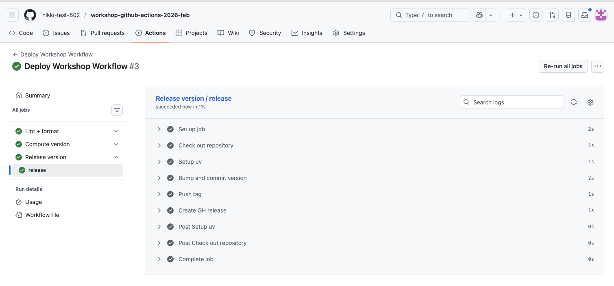

# Lesson 3: Job dependencies (sequential execution)

Up until now, all of the jobs defined in deploy.yml have executed in parallel. In this lesson, we’ll introduce job dependencies so that workflows run in a controlled, sequential way.

The goal of this lesson is to use those dependencies to create a GitHub release, tying together linting, versioning, and a final release step.

By the end of the lesson, you’ll see how sequential execution allows earlier jobs to gate later ones and how this pattern supports reproducible, released versions of your code.

***Objectives:***

- Define a "Release" job that freezes code at its current state and creates a GitHub release
- Understand how to define job dependencies using `needs` and how to communicate between jobs using `with`
- Define a dependency on the "Release" job so that it requires the "Lint + Format" and "Version" jobs to run and complete before execution
- Pass the `app_version` created in the "Version" job to the "Release" job
- Execute and test the final workflow `deploy.yml` in GitHub

## 👉 **Step 16.** Define a "Release" job

The “Release” job ties a specific snapshot of your code to a version, so you can clearly identify which version produced a given set of results.

Add this to the end of the `deploy.yml` file after the "Version" job:

```yaml
  release:
    name: Release version
    uses: ./.github/workflows/release.yml
```

This will run the "Release" reusable workflow job which tags and creates a GitHub release. A GitHub release is a published snapshot of your repository at a specific point in time, usually tied to a Git tag. It can include:
- A git tag, like: `v0.1.0`
- Release metadata: The title (often the version), Release notes or a change log, marked to indicate latest release or prerelease
- Optional assets: Compiled binaries, compressed archives of the codebase, installers, docs, etc.
- [GitHub releases documentation](https://docs.github.com/en/repositories/releasing-projects-on-github/managing-releases-in-a-repository)

🧰 A release allows you to freeze your code and tag it with a specific version. This release can be included in publications to link specific versions and therefore specific states of your codebase that produces specific results.

A release is a great way to provide reproducibility to your codebase, although it is not as convenient as creating and hosting a Docker container image on the GitHub container repository. The container image can be easily pulled down and executed without having to worry about setting up Python library dependencies.

Let's take a deeper look at the `release.yml`:

```yaml
name: (Internal) Release

on:
  workflow_call:
    inputs:
      app_version:
        type: string
        required: true

permissions:
  contents: write

jobs:
  release:
    runs-on: ubuntu-latest
    steps:
      - name: Check out repository
        uses: actions/checkout@v4
        with:
          token: ${{ secrets.PAT_TOKEN || secrets.GITHUB_TOKEN }}

      - name: Setup uv
        uses: astral-sh/setup-uv@v4

      - name: Bump and commit version
        run: |
          uv version ${{ inputs.app_version }}
          git config user.name "${GITHUB_ACTOR}"
          git config user.email "${GITHUB_ACTOR}@users.noreply.github.com"
          git commit -am "Chore: Bump version to ${{ inputs.app_version }}"
          git push

      - name: Push tag
        run: |
          git config user.name "${GITHUB_ACTOR}"
          git config user.email "${GITHUB_ACTOR}@users.noreply.github.com"
          git tag -a "v${{ inputs.app_version }}" -m "Version ${{ inputs.app_version }}"
          git push origin "v${{ inputs.app_version }}"

      - name: Create GH release
        uses: ncipollo/release-action@v1
        with:
          generateReleaseNotes: true
          name: v${{ inputs.app_version }}
          tag: v${{ inputs.app_version }}

```

This job is set up similarly to the other jobs we have seen so far using the same syntax and components that define a GitHub Actions workflow file.

The "Release" job performs a few tasks in order to create a GitHub release:
1. Defines inputs to the `workflow_call` so that the "Release" job is passed the `app_version` from the "Version" job
2. Checks out the repository using a token:
    - `secrets.PAT_TOKEN` - This is a [personal access token](https://docs.github.com/en/authentication/keeping-your-account-and-data-secure/managing-your-personal-access-tokens) that you would create and save to [GitHub Secrets](https://docs.github.com/en/actions/how-tos/write-workflows/choose-what-workflows-do/use-secrets) (we won't delve into this in this workshop as it covers a more advanced use case)
    - `secrets.GITHUB_TOKEN` - This is a short-lived authentication token that GitHub automatically creates for every workflow run. It lets your GitHub Actions workflow authenticate to the GitHub API as the repository itself. There is no further action needed to use this token.
    - One of these is required because the release step will commit the new version to the codebase
2. Set up `uv` so it is available on the runner (underlying machine running the GitHub workflow)
3. Bump and commit the version: This will set the version to the version created by the "Version" job and commit the changes made to the `pyproject.toml` and `uv.lock` files which track the current version
4. Push tag - Creates and pushes a tag to the GitHub repository. A [tag](https://git-scm.com/book/en/v2/Git-Basics-Tagging) is a named pointer to a specific commit in your repository.
5. Create GH release - Creates the [GitHub release](https://docs.github.com/en/repositories/releasing-projects-on-github/about-releases) with release notes, a name, and a tag (which is the same as the tag created in the previous step)

## 👉 **Step 17.** Update the permissions for the "Release" job

The permissions in the `release.yml` file are:

```yaml
permissions:
  contents: write
```

These permissions allow the GitHub Actions workflow to read and modify repository contents (commits, tags, releases). This way the "Release" job can create a GitHub release.

These permissions need to be propagated to the top-level workflow defined in `deploy.yml` in order for the "Release" job can use them.

Modify the `deploy.yml` file permissions which should look like this from the previous steps:

```yaml
permissions:
  contents: read
```

To:

```yaml
permissions:
  contents: write
```

## 👉 **Step 18.** Define a job dependency and communicate the version

Now that we added the "Release" job, how does it get the version number from the "Version" job and use it to update the version of the project, tag the current commit, and tag the release?

We need to define the dependency between the "Release" job and all other jobs and then we can use that definition to set up the inputs to the "Release" job.

Modify the current "Release" definition in `deploy.yml` to add in `needs` and `with`

```yaml
  release:
    name: Release version
    uses: ./.github/workflows/release.yml
    needs: [lint-and-format, version]
    with:
      app_version: ${{ needs.version.outputs.app_version }}
```

- `needs` defines what other jobs need to run and complete before the current "Release" job can run.
  - The "Release" job requires the "Version" job to complete before it runs as it requires the `app_version` as input but we also set the `lint-and-format` reference as we don't want to create a "Release" without running the "Lint + Format" job on the codebase. This way we know the code is well formatted before freezing it in the release process.
- `with` provides input parameters to the "Release" job and connects the output of the "Version" job to the input of the "Release" job.
  - The value references the `needs` field and in particular the `version` job outputs to retrieve the `app_version` from the "Version" job. Remember we had defined the outputs of the "Version" job like so:

      ```yaml
      on:
        workflow_call:
          outputs:
            app_version:
              description: Computed app version
              value: ${{ jobs.version.outputs.app_version }}
      ```

  - And the inputs of the "Release" job like so:

    ```yaml
    on:
      workflow_call:
        inputs:
          app_version:
            type: string
            required: true
    ```

**Tying it all together**, we:

1) Defined the `app_version` output in the "Version" job
2) Defined the `app_version` input in the "Release" job
3) Defined the `release` job in the `deploy.yml` file and set it's dependency on the "Version" job using the `needs` field
4) Defined the `app_version` input to the "Release" job using `with`

## 👉 **Step 19.** Execute a job conditionally using `if`

We now have a "Lint + Format", "Version", and "Release" jobs. The "Lint + Format" and "Version" jobs execute in parallel while the "Release" job executes sequentially after both jobs are complete. Here is the current definition file:

```yaml
name: Deploy Workshop Workflow

on:
  workflow_dispatch:    # Allow manual triggering of the workflow

permissions:
  contents: write

jobs:
  lint-and-format:
    name: Lint + format
    uses: ./.github/workflows/lint-and-format.yml

  version:
    name: Compute version
    uses: ./.github/workflows/version.yml

  release:
    name: Release version
    uses: ./.github/workflows/release.yml
    needs: [lint-and-format, version]
    with:
      app_version: ${{ needs.version.outputs.app_version }}
```

What if the "Version" job fails to create the `app_version`, would we still want to create a "Release"?

Probably not, as this might create an incomplete release that doesn't accurately capture the current state of the project and the version. This is where the conditional expression `if` comes in.

Add the `if` key to the "Release" job in the `deploy.yml` file so the "Release" job only runs if the "Version" job completed successfully and the `app_version` variable is populated:

```yaml
  release:
    name: Release version
    uses: ./.github/workflows/release.yml
    needs: [lint-and-format, version]
    if: needs.version.result == 'success' && needs.version.outputs.app_version != ''
    with:
      app_version: ${{ needs.version.outputs.app_version }}
```

## 👉 **Step 20.**  Commit and push the updated workflow

We can test the workflow now that you have an updated `deploy.yml` with the "Release" job, dependencies, and `app_version` inputs/outputs defined.

Updated `deploy.yml` file:

```yaml
name: Deploy Workshop Workflow

on:
  workflow_dispatch:    # Allow manual triggering of the workflow

permissions:
  contents: write

jobs:
  lint-and-format:
    name: Lint + format
    uses: ./.github/workflows/lint-and-format.yml

  version:
    name: Compute version
    uses: ./.github/workflows/version.yml

  release:
    name: Release version
    uses: ./.github/workflows/release.yml
    needs: [lint-and-format, version]
    if: needs.version.result == 'success' && needs.version.outputs.app_version != ''
    with:
      app_version: ${{ needs.version.outputs.app_version }}
```

Let's test the workflow by committing, pushing, and executing the workflow.

1. Commit the modified file

```bash
git add .github/workflows/deploy.yml
git commit -m "Add a release step to freeze codebase at a specific version"
```

2. Push the commit up to GitHub

```bash
git push origin main
```

**✅ Verification Checkpoint**

- The `deploy.yml` file includes a Release job
- The Release job:
  - Depends on both Lint + format and Compute version using needs
  - Receives the version via:
      ```bash
      with:
        app_version: ${{ needs.version.outputs.app_version }}
      ```
- Includes a conditional if statement to guard execution
- Workflow permissions allow releases:
    ```bash
    permissions:
      contents: write
    ```
- The updated `deploy.yml` file has been committed and pushed

## 👉 **Step 21.** Execute the updated workflow

1. Go to the GitHub "Actions" tab for the project repository


2. Run the "Deploy Workshop Workflow" by clicking through the "Run workflow" buttons. See ["Step 16. Run the GitHub Actions workflow"](#step-16-run-the-github-actions-workflow) for details on how to execute the workflow manually


3. If you click on the workflow, you are directed to the "Summary" page where you will see the jobs executing. You should see the "Lint + Format" and "Compute version" job execute in parallel and then the "Release" job should execute sequentially.


4. Click on the "Release version/release" job, you should see all of the "Release" job steps completed successfully. Feel free to explore each step's logs



5. Verify the release was created. Navigate to the home page of the repository and look for the "Releases" section in the right column


6. Click on the version tag, (e.g., `v0.1.1`) to view the full release details


- You can view the full change log of commits or you can download compressed archives of the repository codebase

**✅ Verification Checkpoint**

- The Deploy Workshop Workflow run completes successfully
- Lint + Format and Compute version run first (in parallel)
- Release version runs after both jobs complete
- A new GitHub release is created:
    - Visible under the repository’s Releases section
    - Tagged with the expected version (e.g., v0.1.1)
    - The release page shows release notes and downloadable source archives

## Summary

In **Lesson 1**, you built a mental model for GitHub Actions and explored how workflows can support reproducible scientific code by connecting code changes to automation.

In **Lesson 2**, you put that model into practice by defining and running your own workflows, adding linting, formatting, and versioning to a real repository.

In **Lesson 3**, you introduced job dependencies and releases, tying specific versions of the code to reproducible, citable snapshots. More specifically you:

- Tied a versioned release to a specific state of the code
- Defined a Release job to create a GitHub release
- Updated permissions to allow writing tags and releases
- Added job dependencies so Release runs after Lint + Format and Version
- Guarded the Release job with a conditional on a valid app_version
- Committed the updated workflow to GitHub and executed

Final `deploy.yml` file:

```yaml
name: Deploy Workshop Workflow

on:
  workflow_dispatch:    # Allow manual triggering of the workflow

# 🔍 Checkpoint #3: Update the permissions to aggregate all required from reusable workflow files
permissions:
  contents: write

jobs:
  lint-and-format:
    name: Lint + format
    uses: ./.github/workflows/lint-and-format.yml

  version:
    name: Compute version
    uses: ./.github/workflows/version.yml

  release:
    name: Release version
    uses: ./.github/workflows/release.yml
    # 🔍 Checkpoint #4: Define for any or all of the jobs you define in the deploy.yml file
    needs: [lint-and-format, version]
    if: needs.version.result == 'success' && needs.version.outputs.app_version != ''
    with:
      app_version: ${{ needs.version.outputs.app_version }}
```

🔍 Checkpoint #3: You can use any of the workflows listed as "(Internal)" in the `.github/workflows` directory in your own codebase but you will need to aggregate the permissions across all of these files and define them in the top-level `deploy.yml`. If you use all of the files the permissions would look like this:

  ```yaml
  permissions:
    actions: read
    contents: write
    packages: write
    security-events: read
  ```
> See ["Step 11. Define workflow permissions"](#step-11-define-workflow-permissions) for info on each of these permissions

🔍 Checkpoint #4: You can modify the `needs` field to include any of the jobs you may define in the `deploy.yml` and to suit your expectations of how the workflow jobs should run.

- For example, you may want to implement security scanning into your workflow, so you add in the "Scan" job (`scan.yml`).
- But you don't want require the "Release" job to run before the code is scanned so you leave that out of the `needs` list.
- Although it is probably a good idea to freeze your codebase on code that does not have vulnerabilities.

> ✨ Pause for Reflection #3 (3 min) ✨
> You now know how to create a release automatically after versioning so your codebase can be referenced precisely.
> 1. What clicked, and what didn’t? Name one concept you feel solid on and one that’s still fuzzy.
> 2. Where would you place this in your real workflow?
>    - On every push to main? Only on tagged commits? Only when a PR is merged?
> 3. What would you want included in your release “artifact set”?
>    - source snapshot only, container image, generated figures, config files, environment lockfile, data manifest

**Lesson 4** builds on this foundation with optional, advanced patterns. It shows how the same workflow structure can be extended to handle more complex execution patterns—running jobs across multiple environments and sharing files between jobs. These features are common in larger projects and collaborative codebases, but they are not required to achieve the core goals of the workshop.

This lesson is best for participants who want to run workflows across multiple environments, automate testing, or capture and reuse files like plots or reports as part of their analysis.