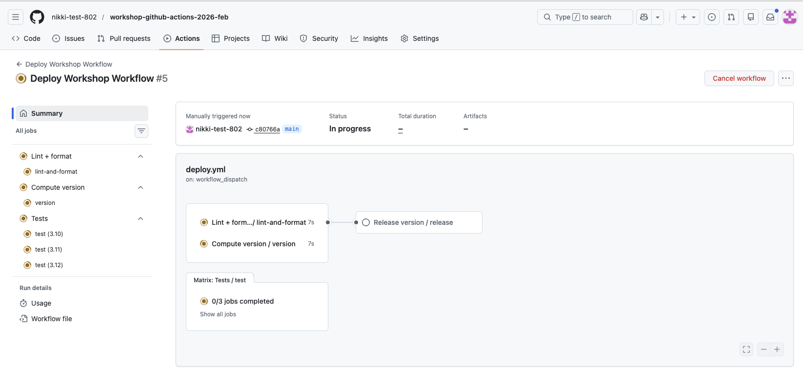
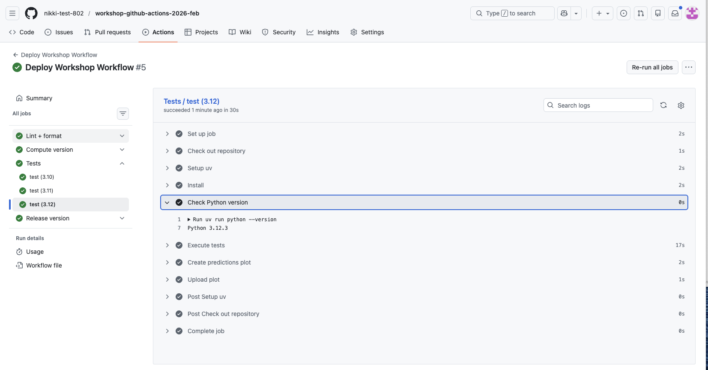
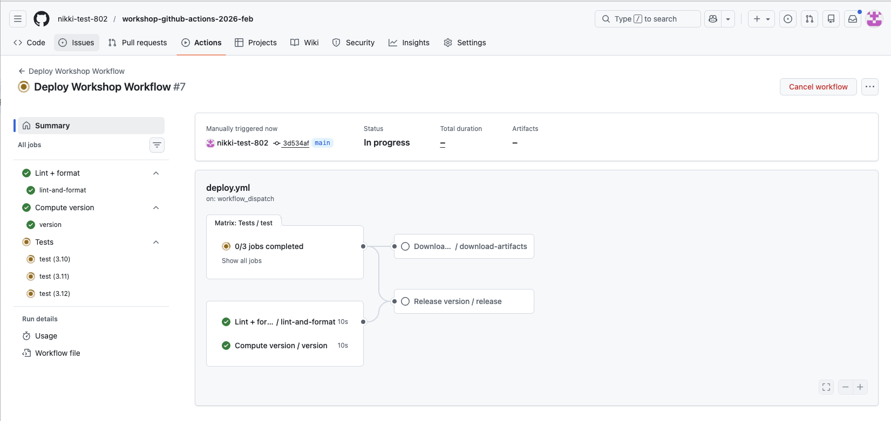

# Lesson 4 (Bonus): Matrices and Artifacts

This lesson includes some extra bonus content on two other helpful GitHub Actions features:

1) Executing tests on multiple Python versions using `matrix`
2) How to upload and download artifacts to communicate between jobs.

These patterns build on the workflows you’ve already created and show how automation can capture both execution and results.

***Objectives***

- Define a "Test" job that executes on multiple versions of Python using the `matrix` strategy
- Understand how to upload artifacts so other jobs can access files created by job steps
- Understand how to download artifacts in a job and access the downloaded file

## 👉 **Step 22.** Update `pyproject.toml` to include a build system so tests can be run

First (prior to making any changes) pull down the recent changes made to the `main` branch from the previous GitHub Actions workflow executions

```bash
# Pull recent changes to `main` as this may have been modified by the "Release" job
git pull origin main
```

Modify the `pyproject.toml` and replace the contents with this version:

```toml
[build-system]
requires = ["setuptools>=68", "wheel"]
build-backend = "setuptools.build_meta"

[project]
name = "sst"
version = "0.1.1"
description = "A sea surface temperature ML prediction package for workshops (SST + ENSO)."
readme = "README.md"
requires-python = ">=3.10"
license = { text = "MIT" }
authors = [{ name = "Nikki Tebaldi" }]

dependencies = [
  "numpy>=1.26",
  "pandas>=2.1",
  "scikit-learn>=1.3",
  "matplotlib>=3.8",
  "seaborn>=0.13.2",
  "typer>=0.9",
  "ruff>=0.14.10",
  "pytest>=9.0.2",
]

[project.scripts]
sst = "sst.cli:app"

[tool.setuptools]
package-dir = { "" = "src" }
```

This adds a `[build-system]` section which allows the `sst` repository to be installed as a package and used in the execution of the tests. We won't dive into this too far as there could be a whole other workshop on Python packaging.

## 👉 **Step 23.** Define a "Test" job that executes on multiple versions of Python

Update the `deploy.yml` file to include the "Test" job (`test.yml`)

```yaml
test:
  name: Tests
  uses: ./.github/workflows/test.yml
```

Update the "Release" job in the `deploy.yml` to require the `test` job before executing. This way we are creating a release after the successful execution of the tests:

```yaml
  release:
    name: Release version
    uses: ./.github/workflows/release.yml
    needs: [lint-and-format, version, test]
    if: needs.version.result == 'success' && needs.version.outputs.app_version != ''
    with:
      app_version: ${{ needs.version.outputs.app_version }}
```

Let's take a look at the `test.yml` file:

```yaml
name: (Internal) Test

on:
  workflow_call:

jobs:
  test:
    runs-on: ubuntu-latest
    strategy:
      matrix:
        python-version: ["3.10","3.11","3.12"]
    steps:
      - name: Check out repository
        uses: actions/checkout@v4

      - name: Setup uv
        uses: astral-sh/setup-uv@v4
        with:
          version: "latest"
          python-version: ${{ matrix.python-version }}

      - name: Install
        run: uv sync

      - name: Check Python version
        run: uv run python --version

      - name: Execute tests
        run: uv run pytest -q

      - name: Create predictions plot
        run: uv run python -m sst.cli --start 2000-01

      - name: Upload plot
        uses: actions/upload-artifact@v4
        with:
          name: trends-${{ matrix.python-version }}
          path: artifacts/ml_predictions.png
```

The "Test" job executes the unit tests defined in the `tests` directory using `pytest` by:

1. Defining a `strategy` that uses a `matrix` of Python versions. A strategy defines how a job is executed while a matrix is a way to run the same job multiple times with different inputs. See [this documentation](https://docs.github.com/en/actions/how-tos/write-workflows/choose-what-workflows-do/run-job-variations) for more info. This means the "Test" job will be executed three times (one for each Python version)
    - 🧰 This is a great way to test that your code is compatible with multiple Python versions if you want to support more than one version amongst collaborators
2. The job checks out the current code in the repository
3. Then it sets up `uv` using the Python version defined in the matrix, `with` points to the specific matrix element that workflow is executing on : `matrix.python-version`
4. `uv` is then used to install dependencies needed by the tests and then runs the tests using `pytest`
5. The Python version is printed out as a test to ensure the `matrix` definition is working as intended
6. We will discuss the creation and upload of the predictions plot in the section on "Artifacts"

🧰 Step 3 works well for our example because we use `uv` to run each test command. If you want to make a specific Python version available to all installed tools on the runner use the `actions.setup-python@v5`:

```yaml
- name: Set up Python
  uses: actions/setup-python@v5
  with:
    python-version: ${{ matrix.python-version }}
```

## 👉 **Step 24.** Commit, push, and execute the updated workflow

We can test the updated `deploy.yml` file to see if multiple "Test" jobs are run on the three defined Python versions.

Full `deploy.yml` file:

```yaml
name: Deploy Workshop Workflow

on:
  workflow_dispatch:    # Allow manual triggering of the workflow

permissions:
  contents: write

jobs:
  lint-and-format:
    name: Lint + format
    uses: ./.github/workflows/lint-and-format.yml

  version:
    name: Compute version
    uses: ./.github/workflows/version.yml

  release:
    name: Release version
    uses: ./.github/workflows/release.yml
    needs: [lint-and-format, version]
    if: needs.version.result == 'success' && needs.version.outputs.app_version != ''
    with:
      app_version: ${{ needs.version.outputs.app_version }}

  test:
    name: Tests
    uses: ./.github/workflows/test.yml

```

1. Commit and push recent changes to GitHub

```yaml
# Commit and push recent changes
git add .github/workflows/deploy.yml pyproject.toml
git commit -m "Define a 'Test' job to execute on multiple Python versions"

# Push recent changes up to GitHub
git push origin main
```

2. Test the workflow in GitHub. See ["Step 16. Run the GitHub Actions workflow"](#step-16-run-the-github-actions-workflow) for details on how to run the workflow.



3. Once the workflow has executed, review the "Test" jobs that were created and executed by clicking on "3 jobs completed" > "Tests/ test (3.12)"


4.  Look at the logs for the "Check Python version" step and see that the Python version was: `Python 3.12.3`



Feel free to view the logs for the other versions to make sure things look correct.

**✅ Verification Checkpoint**

- The Deploy Workshop Workflow runs successfully
- A Test job executes multiple times using a matrix:
    - Separate runs for Python 3.10, 3.11, and 3.12
- Each Test job:
    - Prints the correct Python version in the logs
    - Completes successfully with a green checkmark
- The workflow summary shows multiple Test jobs created from a single definition

## 👉 **Step 25.** Download the artifacts created in the "Test" jobs

In step 15, we covered how to run tests on multiple Python versions and each of these versions uploads a plot created by the execution of the `sst` program.

"Test" job definition highlight of the upload operation:

```yaml
      - name: Upload plot
        uses: actions/upload-artifact@v4
        with:
          name: trends-${{ matrix.python-version }}
          path: artifacts/ml_predictions.png
```

The `actions/upload-artifact@v4` takes files created during a job and saves them as downloadable artifacts attached to that workflow run. If you go back to the "Summary" page of the GitHub Actions workflow you executed in step 16, you should see "Artifacts" listed at the bottom of the summary.


You can download them and review the plots. But what if you wanted to use these files in another GitHub Actions workflow job? Let's create a toy example that downloads the artifacts to a job (`download-artifact.yml`) and lists the available files after download.

But first let's pull down any changes made by the "Release" job prior to making any file modifications in the repo:

```bash
git pull origin main    # Pull down any release changes
```

Add the "Download Test Artifacts" job to the `deploy.yml` file:

```yaml
  download-artifacts:
    name: Download test artifacts
    needs: test
    uses: ./.github/workflows/download-artifact.yml
```

- The `needs` is critical as this job needs to run after the artifacts have been created and uploaded

Let's review the `download-artifact.yml` file:

```yaml
name: (Internal)Download Test Artifacts

on:
  workflow_call:

jobs:
  download-artifacts:
    runs-on: ubuntu-latest
    steps:
      - name: Download artifact for Python 3.10
        uses: actions/download-artifact@v4
        with:
          name: trends-3.10
          path: artifacts/python-3.10

      - name: Download artifact for Python 3.11
        uses: actions/download-artifact@v4
        with:
          name: trends-3.11
          path: artifacts/python-3.11

      - name: Download artifact for Python 3.12
        uses: actions/download-artifact@v4
        with:
          name: trends-3.12
          path: artifacts/python-3.12

      - name: List downloaded artifacts
        run: |
          echo "Downloaded artifacts:"
          find artifacts -type f -name "*.png" || echo "No PNG files found"
          ls -la artifacts/*/ || echo "No artifact directories found"

```

- This workflow job uses the `actions/download-artifact@v4` GitHub Action to download the plots from the previous test jobs
- `with` defines the `name` of the plot and sets the `path` to download the plot to
- The final step lists the available downloads to show the plots have been downloaded

## 👉 **Step 26.** Commit, push, and execute the updated workflow

Let's test the final workflow to see if the plots get downloaded.

Final `deploy.yml` file:

```yaml
name: Deploy Workshop Workflow

on:
  workflow_dispatch:    # Allow manual triggering of the workflow

permissions:
  contents: write

jobs:
  lint-and-format:
    name: Lint + format
    uses: ./.github/workflows/lint-and-format.yml

  version:
    name: Compute version
    uses: ./.github/workflows/version.yml

  test:
    name: Tests
    uses: ./.github/workflows/test.yml

  download-artifacts:
    name: Download test artifacts
    needs: test
    uses: ./.github/workflows/download-artifact.yml

  release:
    name: Release version
    uses: ./.github/workflows/release.yml
    needs: [lint-and-format, version, test]
    if: needs.version.result == 'success' && needs.version.outputs.app_version != ''
    with:
      app_version: ${{ needs.version.outputs.app_version }}

```
- Note the order has been changed so that the steps are listed in the order they execute
- The `download-artifacts` and `release` job can execute in parallel as they don't require any data from each other to execute

1. Commit and push the recent modifications to GitHub

```yaml
git add .github/workflows/deploy.yml
git commit -m "Add toy example to download artifacts from Test jobs"
git push origin main
```

2. Execute the workflow in GitHub, see ["Step 16. Run the GitHub Actions workflow"](#step-16-run-the-github-actions-workflow) for details on how to execute



3. After execution completes, verify the plots were downloaded by clicking on "Downlo.../download-artifacts and viewing the logs for the "List downloaded artifacts" step


* The "Download Test Artifacts" job downloaded all three `ml_predictions.png` plots for each Python version executed by the test

**✅ Verification Checkpoint**

- The **Download test artifacts job** runs after the **Test** jobs
- The job completes successfully with a green checkmark
- The job logs list downloaded files:
    - One plot for each Python version (e.g., `python-3.10`, `python-3.11`, `python-3.12`)
- The listed files `include ml_predictions.png` in each directory

## Summary

In this bonus lesson, you extended your workflow to run jobs across multiple environments and share files between jobs. Using matrix and artifacts, you saw how GitHub Actions can capture both execution and results.

**Key outcomes:**

- Ran tests across multiple Python versions using matrix
- Uploaded result files as artifacts during test runs
- Downloaded artifacts in a downstream job
- Verified one plot per Python version was retrieved successfully

This pattern shows how workflows can automate not just code checks, but also the generation and reuse of scientific outputs.

Final `deploy.yml`

```yaml
name: Deploy Workshop Workflow

on:
  workflow_dispatch:    # Allow manual triggering of the workflow

permissions:
  contents: write

jobs:
  lint-and-format:
    name: Lint + format
    uses: ./.github/workflows/lint-and-format.yml

  version:
    name: Compute version
    uses: ./.github/workflows/version.yml

  test:
    name: Tests
    uses: ./.github/workflows/test.yml

  download-artifacts:
    name: Download test artifacts
    needs: test
    uses: ./.github/workflows/download-artifact.yml

  release:
    name: Release version
    uses: ./.github/workflows/release.yml
    needs: [lint-and-format, version, test]
    if: needs.version.result == 'success' && needs.version.outputs.app_version != ''
    with:
      app_version: ${{ needs.version.outputs.app_version }}
```

> ✨ Pause for Reflection #4 (2–3 min) ✨
> You’ve seen two powerful add-ons: matrix testing and artifacts.
> 1. Matrix: Would testing multiple Python versions help your collaboration, or just add noise? Why?
> 2. Artifacts: What’s one file you wish your workflow produced automatically every run?
    - e.g., a plot, metrics JSON, model evaluation report, parameter summary, logs, a paper-ready figure